# Chat — flow diagrams

A map to `chat_EN.md`: the same thing, drawn. There is not one decision here that
is not in the spec — where a diagram and the text disagree, the text is right and
the diagram is the bug.

**None of this is built.** Not one table from §8 exists in the database, and the
`relay.ts` route answers `501`. These diagrams describe an intent, not a running
system.

Headings link to the section the flow was taken from.

---

## 1. First run: an identity is created ([§8.2](chat_EN.md))

There is no anonymous browsing: name and age are asked **before the feed**,
because the feed itself depends on age. A name is publishable text and goes
through the same moderation a feed phrase does, but **at the first publication,
not here**: at step 1 the queue does not exist yet, and before the first post the
name is visible to nobody (edit of 2026-08-23, per the decision of 2026-08-20).

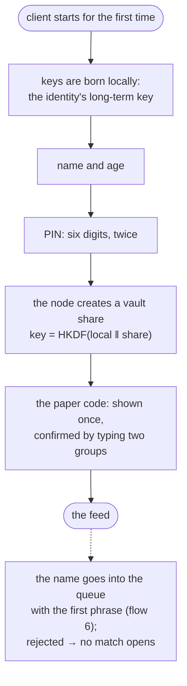
```mermaid
flowchart TD
  start(["client starts for the first time"]) --> keys["keys are born locally:<br/>the identity's long-term key"]
  keys --> form["name and age"]
  form --> pin["PIN: six digits, twice"]
  pin --> share["the node creates a vault share<br/>key = HKDF#40;local ‖ share#41;"]
  share --> code["the paper code: shown once,<br/>confirmed by typing two groups"]
  code --> feed(["the feed"])
  feed -.-> namecheck["the name goes into the queue<br/>with the first phrase #40;flow 6#41;;<br/>rejected → no match opens"]
```

- There is no email and no password by construction. After a lost device the only
  way back is the paper code, which we can neither look up nor reset.
- The node holds **only the public half** of the key: a leaked database does not
  let anyone impersonate people.
- Every client starts as a **separate** identity. Web on a phone, web on a laptop
  and `depth` in a container are three different neighbours until somebody moves
  the identity there themselves.
- **The paper code is issued here — decided 2026-08-26, reversing the move of
  2026-08-18.** The move rested on «on the first minute there is nothing to
  insure»: no chats, no messages, and a name and an age are retyped in seconds.
  That holds for property and fails for an identity. The cost is asymmetric: a
  person the screen did not convince leaves and comes back a day later; a person
  who loses the device inside a window with no paper never comes back, because
  there is nothing to present. So the weight is on the explanation, not on the
  moment (`chat_EN.md` §8.2, §13 step 1).
- **The PIN stayed here, and the reason is the terminal.** In the web the keys are
  non-extractable `CryptoKey` objects and the vault key is only needed for history
  that does not exist yet. But `depth` writes its key file immediately and encrypts
  it with that same key: deferring the PIN would leave keys in the clear on disk.

---

## 2. What signs every request ([§8.2](chat_EN.md))

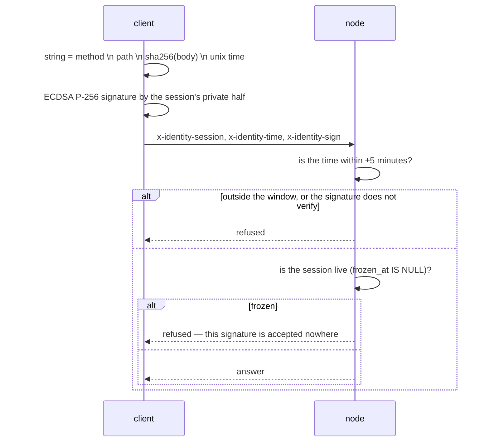
```mermaid
sequenceDiagram
  participant K as client
  participant N as node
  K->>K: string = method \n path \n sha256#40;body#41; \n unix time
  K->>K: ECDSA P-256 signature by the session's private half
  K->>N: x-identity-session, x-identity-time, x-identity-sign
  N->>N: is the time within ±5 minutes?
  alt outside the window, or the signature does not verify
    N-->>K: refused
  else
    N->>N: is the session live #40;frozen_at IS NULL#41;?
    alt frozen
      N-->>K: refused — this signature is accepted nowhere
    else
      N-->>K: answer
    end
  end
```

- **The body enters as a hash, not whole** — otherwise a large request would cost
  twice as much.
- **A window instead of a nonce is a trade.** Whoever captures a whole request can
  replay it within five minutes. A nonce would need shared memory across nodes; at
  a lifetime measured in hours, five minutes of replay is cheaper than a database
  write per request.
- **The signature is ECDSA P-256, decided 2026-08-19 on a measurement.** Ed25519
  stood here and lost to a single number: Chromium 136 and older cannot do it at
  all, so somebody on such a device would not sign a **single** request. P-256
  passed in every engine measured, including those without Ed25519.

---

## 3. PIN, the node's share, and the vault key ([§8.2](chat_EN.md))

Six digits are a million options and no protection on their own. So the vault key
**cannot be assembled from the disk alone**.

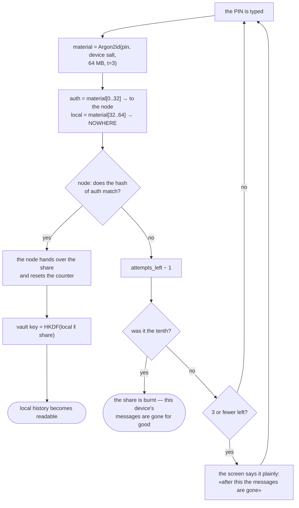
```mermaid
flowchart TD
  pin["the PIN is typed"] --> argon["material = Argon2id#40;pin, device salt,<br/>64 MB, t=3#41;"]
  argon --> split["auth = material[0..32] → to the node<br/>local = material[32..64] → NOWHERE"]
  split --> check{"node: does the hash<br/>of auth match?"}
  check -- "yes" --> give["the node hands over the share<br/>and resets the counter"]
  give --> key["vault key = HKDF#40;local ‖ share#41;"]
  key --> open(["local history becomes readable"])
  check -- "no" --> dec["attempts_left − 1"]
  dec --> burn{"was it the tenth?"}
  burn -- "yes" --> dead(["the share is burnt — this device's<br/>messages are gone for good"])
  burn -- "no" --> warn{"3 or fewer left?"}
  warn -- "yes" --> say["the screen says it plainly:<br/>«after this the messages are gone»"]
  warn -- "no" --> pin
  say --> pin
```

- **The node checks the PIN, not the device.** Otherwise the share is fetched once
  and a million options are tried offline.
- **The share belongs to the device, not to the identity** — each has its own PIN,
  its own share, its own counter. Another device's share is out of reach from
  everywhere, including a live session of the same identity.
- Two prices are named plainly: **without a network the chat does not open at
  all**, and **the node now holds the thing whose loss loses people's messages**.

---

## 4. Moving an identity to another device ([§8.2](chat_EN.md))

One live session per identity is a partial unique index in the database; code
cannot get around it. Moving to another device is not an addition but a **move**.

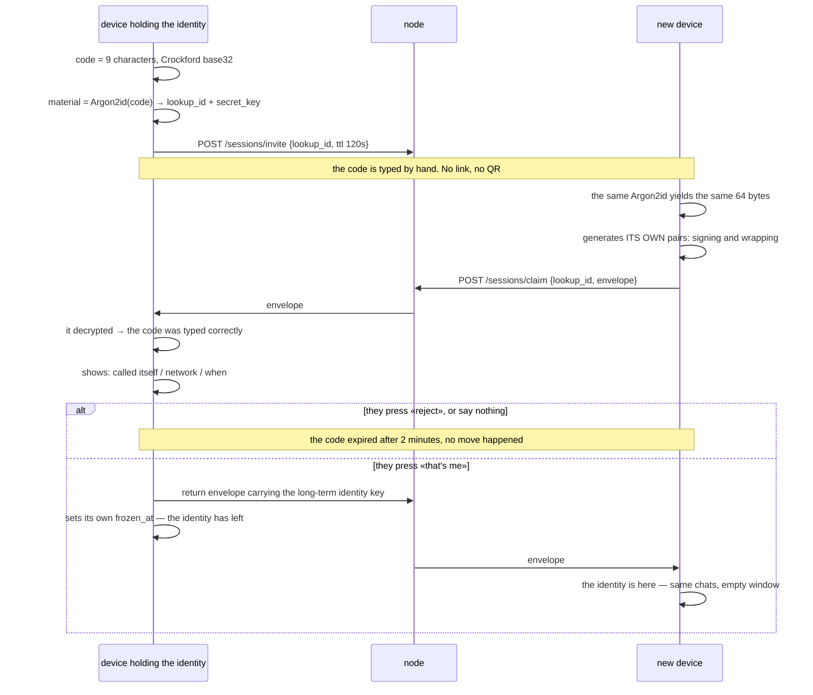
```mermaid
sequenceDiagram
  participant A as device holding the identity
  participant N as node
  participant B as new device
  A->>A: code = 9 characters, Crockford base32
  A->>A: material = Argon2id#40;code#41; → lookup_id + secret_key
  A->>N: POST /sessions/invite #123;lookup_id, ttl 120s#125;
  Note over A,B: the code is typed by hand. No link, no QR
  B->>B: the same Argon2id yields the same 64 bytes
  B->>B: generates ITS OWN pairs: signing and wrapping
  B->>N: POST /sessions/claim #123;lookup_id, envelope#125;
  N->>A: envelope
  A->>A: it decrypted → the code was typed correctly
  A->>A: shows: called itself / network / when
  alt they press «reject», or say nothing
    Note over A,B: the code expired after 2 minutes, no move happened
  else they press «that's me»
    A->>N: return envelope carrying the long-term identity key
    A->>A: sets its own frozen_at — the identity has left
    N->>B: envelope
    B->>B: the identity is here — same chats, empty window
  end
```

**What the node sees:** a `lookup_id` and two opaque envelopes. The long-term key
passes through it encrypted.

**Why stretching is a condition of working at all, not a hardening.** Nine
characters are 45 bits: under an ordinary hash they fall in hours, and the node,
which knows `lookup_id`, would derive `secret_key` itself. Argon2id makes an
attempt cost ~0.1 s; online guessing is closed by five attempts per invitation.

**Confirmation with context** shows three lines, each as honest as it can be:

| line | what it actually is |
|---|---|
| "called itself" | a label from **that** side, confirmed by nothing |
| "network" | a comparison of two addresses the node can see — **a hint, not a verdict** |
| "when" | a fact |

What this step does not do: if somebody talked the person into pressing, it will
not save them. It buys a pause and a fact.

**What freezing does — and does not do:**

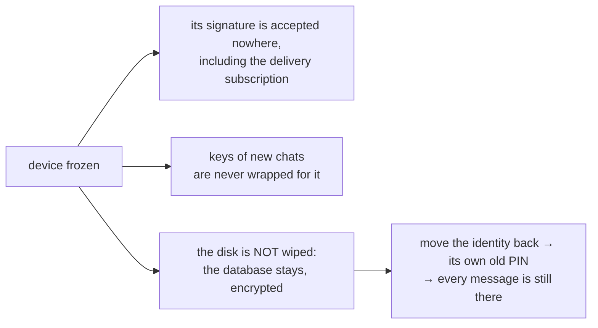
```mermaid
flowchart LR
  froze["device frozen"] --> no1["its signature is accepted nowhere,<br/>including the delivery subscription"]
  froze --> no2["keys of new chats<br/>are never wrapped for it"]
  froze --> yes1["the disk is NOT wiped:<br/>the database stays, encrypted"]
  yes1 --> back["move the identity back → its own old PIN<br/>→ every message is still there"]
```

**A delayed freeze was considered and rejected:** it breaks the main legitimate
case — somebody talked from a borrowed laptop and walked away. When you leave, the
door closes immediately.

---

## 5. Recovery from the paper code ([§8.2](chat_EN.md))

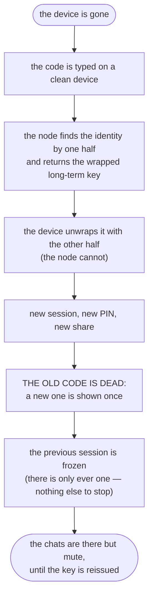
```mermaid
flowchart TD
  lost(["the device is gone"]) --> enter["the code is typed on a clean device"]
  enter --> find["the node finds the identity by one half<br/>and returns the wrapped long-term key"]
  find --> unwrap["the device unwraps it with the other half<br/>#40;the node cannot#41;"]
  unwrap --> new["new session, new PIN, new share"]
  new --> paper["THE OLD CODE IS DEAD:<br/>a new one is shown once"]
  paper --> freeze["the previous session is frozen<br/>#40;there is only ever one — nothing else to stop#41;"]
  freeze --> done(["the chats are there but mute,<br/>until the key is reissued"])
```

- **The paper code can only be changed by presenting the current paper code.**
  Without that rule, whoever steals an identity writes themselves a new one first
  and locks the owner out forever — the insurance disappears exactly when it is
  needed.
- **Recovery itself issues a new code and kills the old one.** People recover
  precisely when something went wrong — including when the paper may have been
  seen.
- **16 characters = 80 bits**, Crockford base32, salt `xor.ad/recovery/v1`,
  Argon2id 64 MB. Guessing is out of reach even with a million identities.
- **Attempts are counted by the endpoint, not by the identity row.** The counter in
  `identities` could barely fire: one wrong character breaks the lookup half, the
  node finds no identity, and there is nothing to decrement. Counting is now per
  address plus a global miss counter.

---

## 6. Publishing a phrase, and moderation ([§8.3](chat_EN.md))

The feed is public and anyone within the radius sees it, so text is checked
**before publication** — but not inside the request.

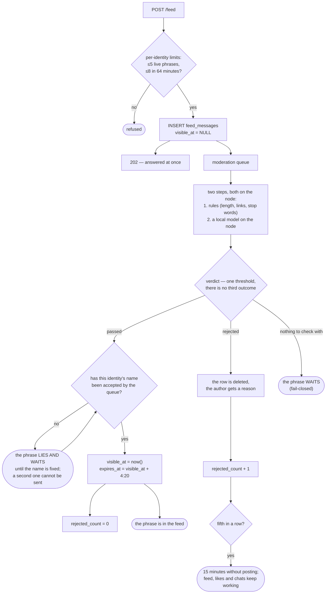
```mermaid
flowchart TD
  post["POST /feed"] --> limits{"per-identity limits:<br/>≤5 live phrases,<br/>≤8 in 64 minutes?"}
  limits -- "no" --> refuse(["refused"])
  limits -- "yes" --> insert["INSERT feed_messages<br/>visible_at = NULL"]
  insert --> ans["202 — answered at once"]
  insert --> queue["moderation queue"]
  queue --> ladder["two steps, both on the node:<br/>1. rules #40;length, links, stop words#41;<br/>2. a local model on the node"]
  ladder --> verdict{"verdict — one threshold,<br/>there is no third outcome"}
  verdict -- "passed" --> name{"has this identity's name<br/>been accepted by the queue?"}
  name -- "no" --> hold(["the phrase LIES AND WAITS<br/>until the name is fixed;<br/>a second one cannot be sent"])
  hold --> name
  name -- "yes" --> live["visible_at = now#40;#41;<br/>expires_at = visible_at + 4:20"]
  live --> zero["rejected_count = 0"]
  live --> shown(["the phrase is in the feed"])
  verdict -- "rejected" --> del["the row is deleted,<br/>the author gets a reason"]
  del --> count["rejected_count + 1"]
  count --> block{"fifth in a row?"}
  block -- "yes" --> mute(["15 minutes without posting;<br/>feed, likes and chats keep working"])
  verdict -- "nothing to check with" --> wait(["the phrase WAITS<br/>#40;fail-closed#41;"])
```

- **"Before publication" is true, not a formality.** While `visible_at` is empty
  the phrase is in nobody's feed but the author's, where it is marked as under
  review. "Publish now, take down later" would make both the storefront policy and
  the Article 28 position a lie.
- **4:20 counts from `visible_at`**, or the queue eats somebody else's lifetime.
- **The first publication waits for the name — amended 2026-08-26, reversing the
  split.** Phrase and name used to be checked apart, and the post went into the
  feed whatever the verdict on the name. That split closed the wrong hole: the
  post lived and was liked while the author's name stayed unchecked, and it
  reached the other person with the very first match. Now a phrase goes out only
  when **both** are accepted; if the name is rejected the phrase lies and
  publishes itself as soon as the name is fixed. `expires_at` counts **from
  publication**, so the wait does not cost it its life, and while it waits no
  second phrase can be sent — otherwise waiting would build a queue around the
  cap (`chat_EN.md` §8.2).
- **A queue failure closes rather than opens.** Fail-open here is exactly the move
  already rejected for links in offers: it will be used, and the night will be
  chosen for it.
- **Five and fifteen are deliberately mild.** A model's refusal is not proof of
  intent: the first to hit the threshold is not a troll but somebody who was
  misread. The threshold should break the rhythm of rewording, not punish.
- The limit stated honestly: an identity takes ten seconds to create and an
  address changes by switching to mobile data. This is **a brake, not a wall**; the
  real defence is the check before publication.

---

## 7. Building the feed ([§8.3](chat_EN.md))

Visibility is the intersection of circles plus the age band, applied
**symmetrically**: if I can see you, you can see me.

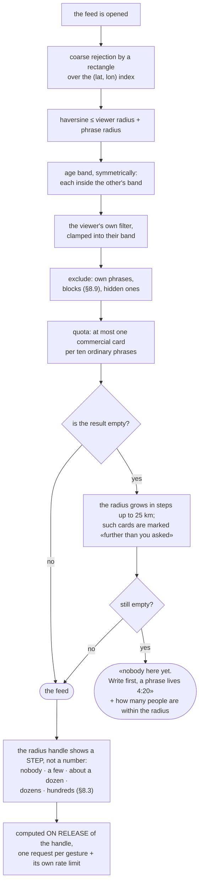
```mermaid
flowchart TD
  ask["the feed is opened"] --> rect["coarse rejection by a rectangle<br/>over the #40;lat, lon#41; index"]
  rect --> hav["haversine ≤ viewer radius + phrase radius"]
  hav --> band["age band, symmetrically:<br/>each inside the other's band"]
  band --> filt["the viewer's own filter,<br/>clamped into their band"]
  filt --> excl["exclude: own phrases,<br/>blocks #40;§8.9#41;, hidden ones"]
  excl --> quota["quota: at most one commercial card<br/>per ten ordinary phrases"]
  quota --> empty{"is the result empty?"}
  empty -- "no" --> show(["the feed"])
  empty -- "yes" --> grow["the radius grows in steps up to 25 km;<br/>such cards are marked «further than you asked»"]
  show --> knob["the radius handle shows a STEP, not a number:<br/>nobody · a few · about a dozen ·<br/>dozens · hundreds #40;§8.3#41;"]
  knob --> once["computed ON RELEASE of the handle,<br/>one request per gesture + its own rate limit"]
  grow --> empty2{"still empty?"}
  empty2 -- "no" --> show
  empty2 -- "yes" --> nobody(["«nobody here yet.<br/>Write first, a phrase lives 4:20»<br/>+ how many people are within the radius"])
```

**The age bands are two non-overlapping worlds with a soft seam:**

```
band(A) = A ≤ 20  →  [max(13, A − 2), A + 2]      -- the sandbox
          A ≥ 21  →  [min(21, A − 2), ∞)          -- the adult pool
```

A 20-year-old sees `[18, 22]`, a 21-year-old `[19, ∞)`: they meet. But 19 and 22 no
longer see each other — the rule breaks on both sides at once, with no one-way
holes.

- **The band never widens**, not even for an empty feed. A sparse sandbox at
  launch is an accepted price, not a problem to be fixed with age.
- **Widening the radius does not change the setting** — it is a temporary answer to
  an empty result, not a quiet edit of preferences.
- A consequence worth knowing in advance: **a like through a widened radius often
  will not become a match**, because the other person did not widen theirs. Except
  on a phrase with a discount, where the match is born one-sidedly.
- The area can be placed **anywhere**: there is no check of real location and no
  geolocation permission is required.

---

## 8. A like ([§8.4](chat_EN.md), [§8.5](chat_EN.md), [§8.7](chat_EN.md))

The client sends only a `feed_message_id` and gets back a `{state}` — who exactly
was liked is never disclosed to it.

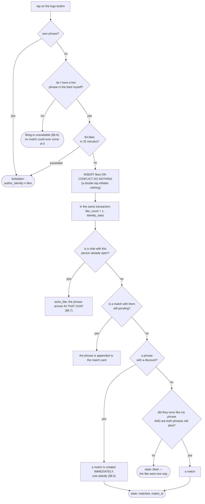
```mermaid
flowchart TD
  tap["tap on the logo button"] --> self{"own phrase?"}
  self -- "yes" --> no(["forbidden:<br/>author_identity ≠ liker"])
  self -- "no" --> alive{"do I have a live<br/>phrase in the feed myself?"}
  alive -- "no" --> nolike(["liking is unavailable #40;§8.4#41;:<br/>no match could ever come of it"])
  alive -- "yes" --> rate{"64 likes<br/>in 32 minutes?"}
  rate -- "exceeded" --> no
  rate -- "no" --> ins["INSERT likes ON CONFLICT DO NOTHING<br/>#40;a double tap inflates nothing#41;"]
  ins --> counters["in the same transaction:<br/>like_count + 1, identity_stats"]
  counters --> chat{"is a chat with this<br/>person already open?"}
  chat -- "yes" --> extra["extra_like: the phrase arrives IN THAT CHAT<br/>#40;§8.7#41;"]
  chat -- "no" --> hanging{"is a match with them<br/>still pending?"}
  hanging -- "yes" --> card["the phrase is appended to the match card"]
  hanging -- "no" --> discount{"a phrase<br/>with a discount?"}
  discount -- "yes" --> m1["a match is created IMMEDIATELY,<br/>one-sidedly #40;§8.5#41;"]
  discount -- "no" --> mutual{"did they once like my phrase<br/>AND are both phrases still alive?"}
  mutual -- "no" --> quiet(["state: liked —<br/>the like went one way"])
  mutual -- "yes" --> m2["a match"]
  m1 --> matched(["state: matched, match_id"])
  m2 --> matched
```

- **Only someone who has a live phrase of their own can like — decided
  2026-08-26.** This is not a new restriction but §8.5 carried to its end: a match
  counts only while **both** phrases are alive, so a like from a person without one
  could never have become a match — it was recorded and went silently nowhere. The
  check runs on the node, because the client is open:
  `EXISTS (SELECT 1 FROM feed_messages WHERE author_identity = :me AND visible_at
  IS NOT NULL AND expires_at > now())`.

---

## 9. The match and the double consent ([§8.5](chat_EN.md))

A match is **not a chat**: it is an offer to talk that both have to accept.

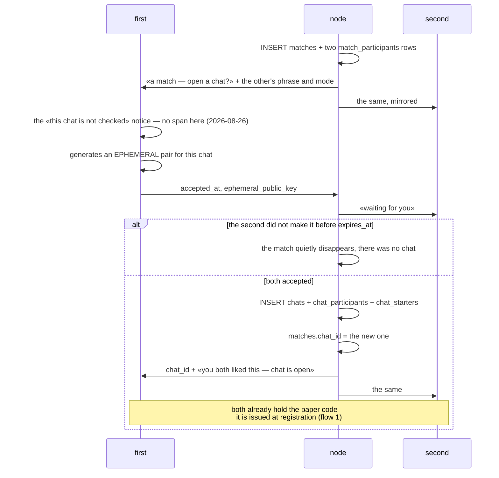
```mermaid
sequenceDiagram
  participant A as first
  participant N as node
  participant B as second
  N->>N: INSERT matches + two match_participants rows
  N->>A: «a match — open a chat?» + the other's phrase and mode
  N->>B: the same, mirrored
  A->>A: the «this chat is not checked» notice — no span here #40;2026-08-26#41;
  A->>A: generates an EPHEMERAL pair for this chat
  A->>N: accepted_at, ephemeral_public_key
  N->>B: «waiting for you»
  alt the second did not make it before expires_at
    N->>N: the match quietly disappears, there was no chat
  else both accepted
    N->>N: INSERT chats + chat_participants + chat_starters
    N->>N: matches.chat_id = the new one
    N->>A: chat_id + «you both liked this — chat is open»
    N->>B: the same
    Note over A,B: both already hold the paper code —<br/>it is issued at registration #40;flow 1#41;
  end
```

**The paper code is no longer on this screen — decided 2026-08-26.** It stood here
from 2026-08-18, and the argument against a gate "before the chat" still holds: the
consent screen already carries the notice and the span choice, with the match timer
running above it, and asking someone to copy sixteen characters with three minutes
on the clock would end in "later" or in a lost match. The conclusion drawn from it
is a different one: the code moved not to after the chat opens but **back to
registration** (flow 1), where no timer presses at all. The first chat asks for
nothing.

**The match TTL** is `least()` of both phrases' `expires_at`, with no safety floor.
Either one dies and the match goes out, even if one side has already accepted. A
new mutual like does **not** extend it.

**The text snapshot is taken at match time**, not at opening: otherwise the phrase
expires between "a match" and "both pressed", and somebody accepts without seeing
the reason.

**The window was left as it is, reconsidered 2026-08-10.** Lengthening it treats
the wrong illness: a match is an offer to talk about **a particular** phrase, and
the freshness of the reason is the substance rather than the packaging. The price
is written down plainly: **a burnt-out match is never seen by the person at all**.

**Three edge cases, all real:**

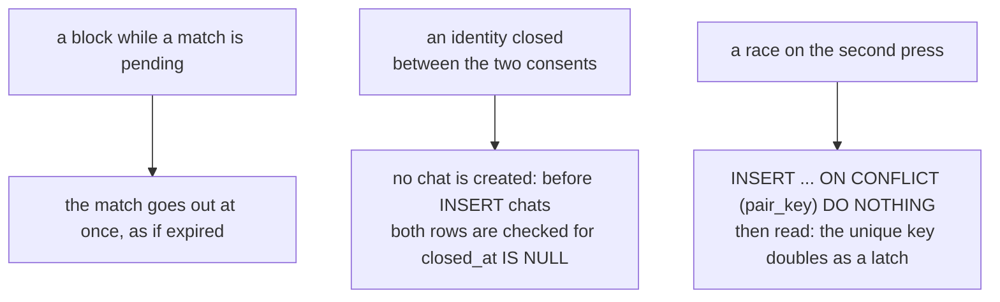
```mermaid
flowchart TD
  edge1["a block while a match is pending"] --> r1["the match goes out at once, as if expired"]
  edge2["an identity closed<br/>between the two consents"] --> r2["no chat is created: before INSERT chats<br/>both rows are checked for closed_at IS NULL"]
  edge3["a race on the second press"] --> r3["INSERT ... ON CONFLICT #40;pair_key#41; DO NOTHING<br/>then read: the unique key doubles as a latch"]
```

**What is disclosed at this step.** Before the match, nothing. On the card: the
other's phrase, its `mode`, name and age. The feed carries no name and no age and
never can — otherwise every phrase by one person is glued together under "Zhenya,
38".

---

## 10. A match from an offer is one-sided ([§8.5](chat_EN.md))

The ordinary rule breaks against its own meaning: to take the stools you would
have to wait for the neighbour giving them away to like some phrase of yours.

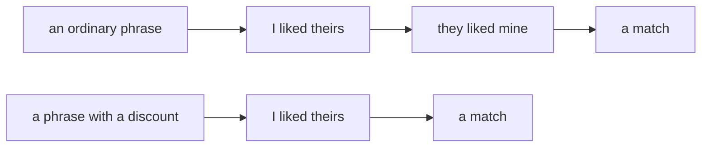
```mermaid
flowchart LR
  a["an ordinary phrase"] --> a1["I liked theirs"] --> a2["they liked mine"] --> a3["a match"]
  b["a phrase with a discount"] --> b1["I liked theirs"] --> b3["a match"]
```

From there the same machine runs unchanged: two `match_participants` rows, the
notice, the double consent. **The offer's author may
decline**, and then there is no chat.

- The one who liked has no phrase of their own → `message_id` and `text_snapshot`
  became nullable.
- The reason in such a match is **one for both** — the offer itself. Its author
  sees their own listing and "is interested in your offer", plus name and age.
- The `TTL` follows the single live phrase — the offer.
- **Venue** offers have no like at all: a like leads to a match, a match to a
  conversation, and there is nobody to converse with.

---

## 11. Opening a chat, and the keys ([§8.13](chat_EN.md))

End-to-end encryption became possible exactly when the chat stopped being
moderated — reading the text and not seeing it are not both possible.

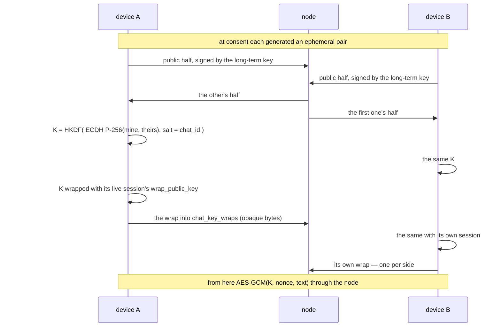
```mermaid
sequenceDiagram
  participant A as device A
  participant N as node
  participant B as device B
  Note over A,B: at consent each generated an ephemeral pair
  A->>N: public half, signed by the long-term key
  B->>N: public half, signed by the long-term key
  N->>A: the other's half
  N->>B: the first one's half
  A->>A: K = HKDF#40; ECDH P-256#40;mine, theirs#41;, salt = chat_id #41;
  B->>B: the same K
  A->>A: K wrapped with its live session's wrap_public_key
  A->>N: the wrap into chat_key_wraps #40;opaque bytes#41;
  B->>B: the same with its own session
  B->>N: its own wrap — one per side
  Note over A,B: from here AES-GCM#40;K, nonce, text#41; through the node
```

- **A key per conversation, not per person.** The long-term identity key takes no
  part in encryption at all. Leaking it allows impersonation but **not reading the
  messages**.
- **The death of a chat erases `K`, the ephemeral keys and the wraps** → old
  ciphertext can no longer be decrypted by anyone. That is forward secrecy.
- **A device that has just received an identity starts with an empty screen**:
  there was nobody to wrap the keys of earlier chats for. The old conversations on
  it are not merely empty but **mute** — `K` stayed on the old device. Fixed by a
  reissue (below), the same after a transfer and after a recovery.
- **Keys of live chats are not rotated on a move**: rotation defends against a
  participant who keeps receiving ciphertext, and a frozen device receives none.

**What this does not give — in plain words:**

| | |
|---|---|
| We serve the very script that encrypts | the honest claim is **the server cannot read the messages after the fact**, not "we are physically unable" |
| Metadata remains | the node knows `chat_id`, both participants, the time of movement and the length |
| It does not protect against the other person | they have the plaintext on screen — by design, or there would be nothing to report with |
| Cryptography does not catch us substituting a key | a **safety code** derived from both long-term keys, shown in the chat header, can be compared aloud |


**Reissuing the key after a device change** — one mechanism for both a transfer
and a recovery:

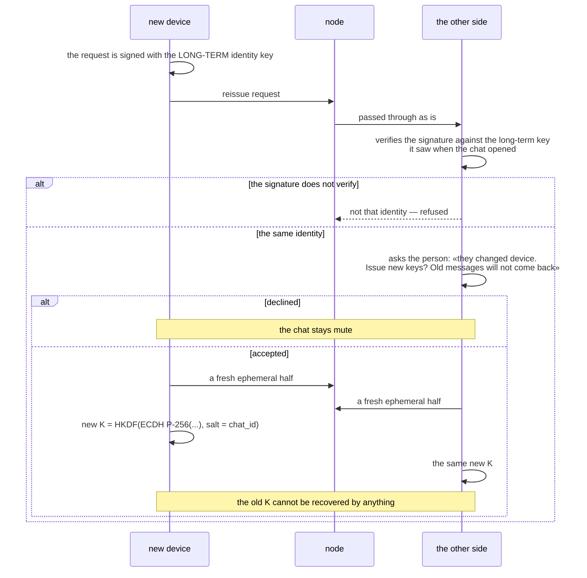
```mermaid
sequenceDiagram
  participant A as new device
  participant N as node
  participant B as the other side
  A->>A: the request is signed with the LONG-TERM identity key
  A->>N: reissue request
  N->>B: passed through as is
  B->>B: verifies the signature against the long-term key<br/>it saw when the chat opened
  alt the signature does not verify
    B-->>N: not that identity — refused
  else the same identity
    B->>B: asks the person: «they changed device.<br/>Issue new keys? Old messages will not come back»
    alt declined
      Note over A,B: the chat stays mute
    else accepted
      A->>N: a fresh ephemeral half
      B->>N: a fresh ephemeral half
      A->>A: new K = HKDF#40;ECDH P-256#40;...#41;, salt = chat_id#41;
      B->>B: the same new K
      Note over A,B: the old K cannot be recovered by anything
    end
  end
```

- **Signed with the long-term key, not a chat membership**: a row in
  `chat_participants` is available to whoever took the identity too. The long-term
  key is the only thing that survives a device change and never sits on the node in
  the clear.
- **The person is asked**, for the same reason a transfer requires "that's me".
- **The safety code does not change** — it comes from the long-term keys, and those
  are the same.
- **Forward secrecy is strengthened**: the new `K` is out of the old device's reach.
- It does not fix the theft of a whole identity: with the long-term key in hand the
  reissue works for an attacker too.

---

## 12. A message ([§8.8](chat_EN.md), [§8.1](chat_EN.md))

**There is no `messages` table.** A message passes through the node encrypted; the
history lives only on the participants' devices.

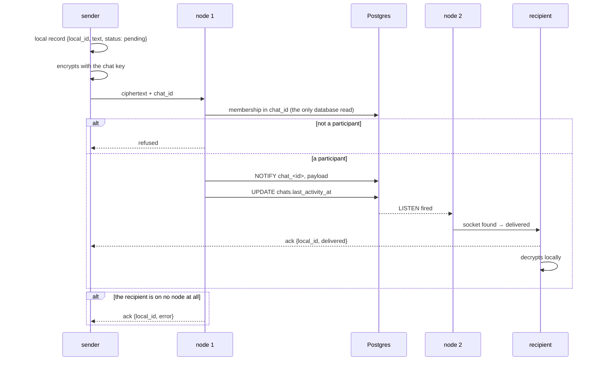
```mermaid
sequenceDiagram
  participant A as sender
  participant N1 as node 1
  participant PG as Postgres
  participant N2 as node 2
  participant B as recipient
  A->>A: local record #123;local_id, text, status: pending#125;
  A->>A: encrypts with the chat key
  A->>N1: ciphertext + chat_id
  N1->>PG: membership in chat_id #40;the only database read#41;
  alt not a participant
    N1-->>A: refused
  else a participant
    N1->>PG: NOTIFY chat_#60;id#62;, payload
    N1->>PG: UPDATE chats.last_activity_at
    PG-->>N2: LISTEN fired
    N2->>B: socket found → delivered
    B-->>A: ack #123;local_id, delivered#125;
    B->>B: decrypts locally
  end
  alt the recipient is on no node at all
    N1-->>A: ack #123;local_id, error#125;
  end
```

**Statuses are state on the sender's client, not a database row:**

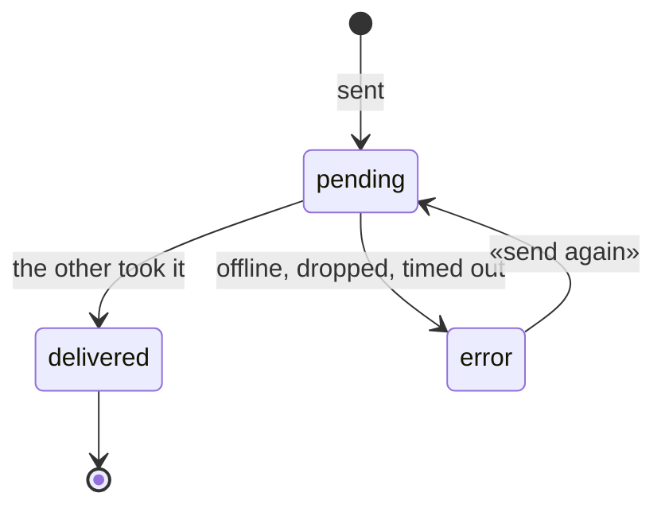
```mermaid
stateDiagram-v2
  [*] --> pending: sent
  pending --> delivered: the other took it
  pending --> error: offline, dropped, timed out
  error --> pending: «send again»
  delivered --> [*]
```

- **Resending is always available on `error`**, regardless of whether the other
  person is online. The pause grows ×3: at once, 5 s, 15 s, 45 s, 135 s, capped
  around 10 min. The retry carries the same `local_id` so the recipient drops the
  duplicate.
- **Length is a server parameter, but the node measures it in bytes.**
  `max_message_length` arrives when the chat opens, 256 by default, and draws the
  counter in the client; `max_ciphertext_bytes` — 2048 bytes — arrives beside it
  and is what refuses with `error`, because the node sees ciphertext and counts no
  characters in it (§8.6, edit of 2026-08-25). Our client is open: a check that
  lives only there is a hint to the author, not a rule of the system.
- **The node must not matter.** A room does not live in one node's memory:
  participants may sit on different ones, and a node falling over drops only its
  own sockets. The limit — the bus works within one database.
- **The chat is not moderated.** Four things work instead: entry by mutual like
  with double consent, blocking, a report carrying its own copy, and ephemerality.

---

## 13. The life and death of a conversation ([§5](chat_EN.md), [§8.6](chat_EN.md))

The span slides and is **each person's own**: it counts from **their own** last
message. Reading is not talking. A move in a game pushes the timer on purpose,
because the game is there so that one can be silent in words.

The same conversation goes through these states **differently for each side**:

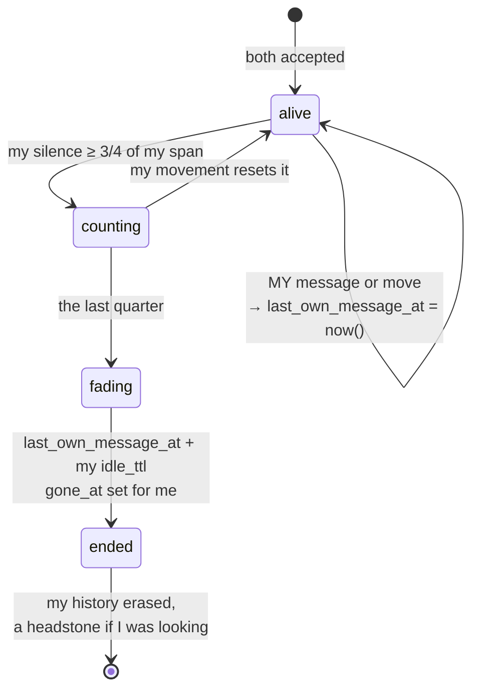
```mermaid
stateDiagram-v2
  [*] --> alive: both accepted
  alive --> alive: MY message or move<br/>→ last_own_message_at = now#40;#41;
  alive --> counting: my silence ≥ 3/4 of my span
  counting --> alive: my movement resets it
  counting --> fading: the last quarter
  fading --> ended: last_own_message_at + my idle_ttl<br/>gone_at set for me
  ended --> [*]: my history erased,<br/>a headstone if I was looking
```

And for the other side at that moment:

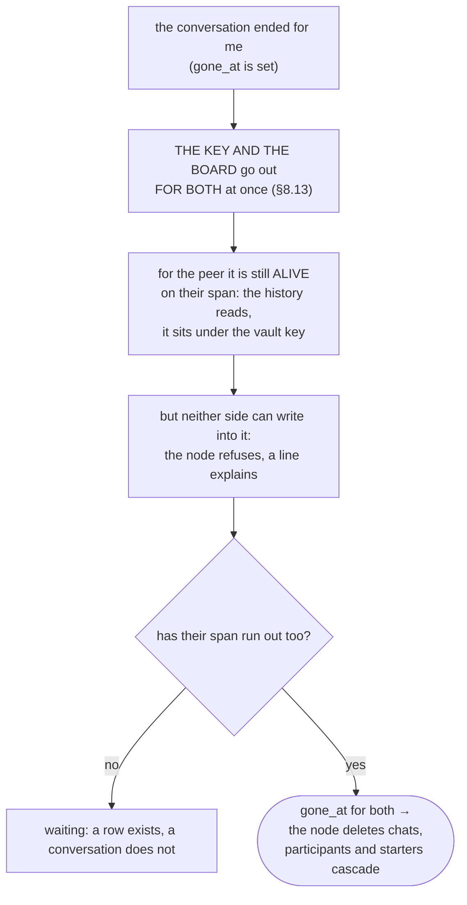
```mermaid
flowchart TD
  mine["the conversation ended for me<br/>#40;gone_at is set#41;"] --> key["THE KEY AND THE BOARD go out<br/>FOR BOTH at once #40;§8.13#41;"]
  key --> peer["for the peer it is still ALIVE<br/>on their span: the history reads,<br/>it sits under the vault key"]
  peer --> nowrite["but neither side can write into it:<br/>the node refuses, a line explains"]
  nowrite --> both{"has their span run out too?"}
  both -- "no" --> wait["waiting: a row exists, a conversation does not"]
  both -- "yes" --> gone(["gone_at for both →<br/>the node deletes chats,<br/>participants and starters cascade"])
```

- Each side picks `idle_ttl_minutes` **inside the conversation**, with the handle
  in the header, from **10 minutes / 30 minutes / an hour / «while we're talking»
  #40;4:20#41;**, and changes it at any time (settled 2026-08-26, reversing the pick at
  consent and the smaller-of-the-two). The span is each person's own and counts
  **from their own last message**: Petya sets ten minutes, Kolya an hour — Petya
  stays silent for ten minutes and the conversation ends **for Petya**. The other
  side's value and remainder are never handed out.
- The counter lights in the **last quarter of your own span**: a fraction, not
  fixed minutes. That is 2:30 on a ten-minute conversation and a quarter of an hour
  on an hour-long one. The old `min(20 min, ttl / 3)` is retired along with the
  pick at consent.
- The server sends nothing: the client knows `last_own_message_at` and its own
  `idle_ttl_minutes` and counts by itself.
- The only thing the server learns about the conversation is **when** there was
  movement. Not the text, not the author, not the count.
- **The conversation key goes out for both at the FIRST death** (§8.13), together
  with the board. The other person's history still reads: it sits under the vault
  key, not the conversation key, and lives until their own span. Neither side can
  write into such a conversation, and one line says so.
- **One chat per pair** while it lives: a unique `pair_key`. After the chat dies
  the `pair_key` is free again and the pair can match anew — but on the ordinary
  rules.

---

## 14. An extra like into an open chat ([§8.7](chat_EN.md))

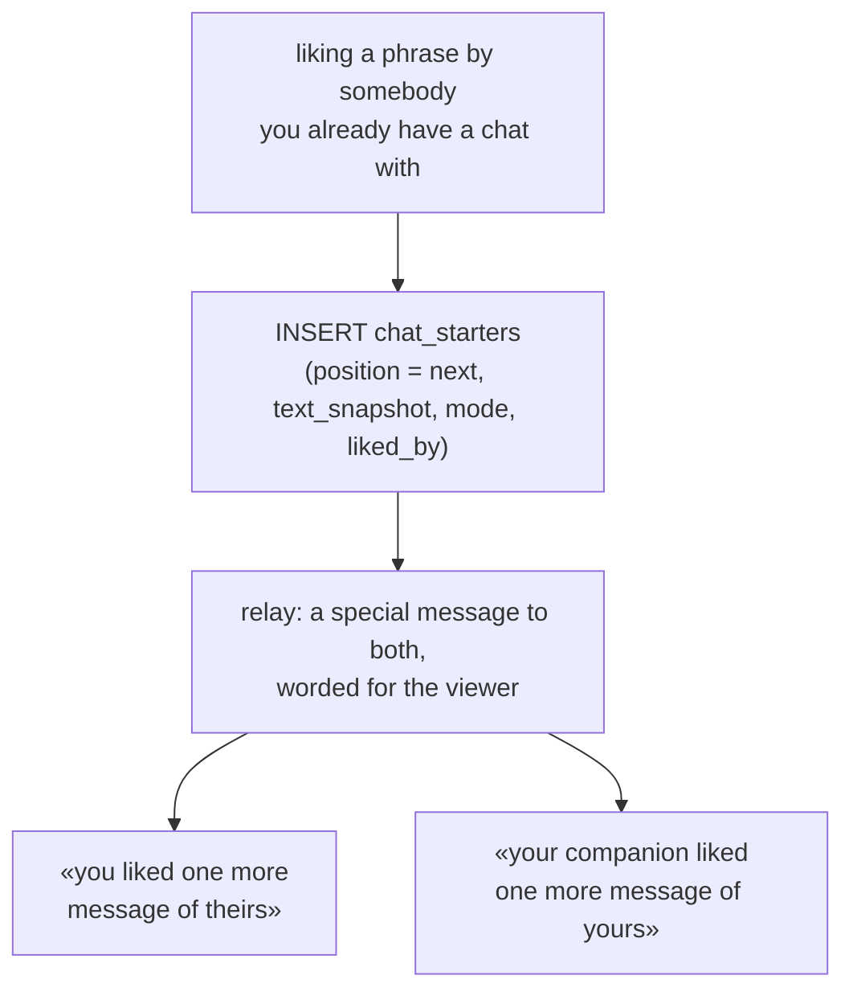
```mermaid
flowchart TD
  like["liking a phrase by somebody<br/>you already have a chat with"] --> row["INSERT chat_starters<br/>#40;position = next, text_snapshot, mode, liked_by#41;"]
  row --> msg["relay: a special message to both,<br/>worded for the viewer"]
  msg --> me["«you liked one more<br/>message of theirs»"]
  msg --> you["«your companion liked<br/>one more message of yours»"]
```

The bubble disappears with the local history; the `chat_starters` row does not. The
card's number matches its number in the `Liked, in order` header: it is the same
thing, arriving later.

---

## 15. A game ([§6](chat_EN.md))

**A game is described by primitives, not by its name — decided 2026-08-26.**
Otherwise every new game is a separate application, and the list already holds
more than a dozen. The engine draws the field and moves the pieces; it knows not
one rule.

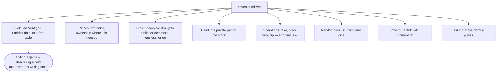
```mermaid
flowchart TD
  prim["seven primitives"] --> f["Field: an N×M grid,<br/>a grid of dots, or a free table"]
  prim --> ch["Pieces: two sides,<br/>ownership where it is needed"]
  prim --> st["Stock: empty for draughts,<br/>a pile for dominoes, endless for go"]
  prim --> hand["Hand: the private part of the stock"]
  prim --> ops["Operations: take, place,<br/>turn, flip — and that is all"]
  prim --> rnd["Randomness: shuffling and dice"]
  prim --> phys["Physics: a flick with momentum"]
  prim --> txt["Text input: the word to guess"]
  f --> add(["adding a game = describing a field<br/>and a set, not writing code"])
```

The classes are built from these primitives: a grid board (draughts, chess,
corners) and a free table (dominoes) need nothing beyond the four operations; a
grid of dots adds drawing along edges; a deck and a hand add shuffling, a private
hand and a discard pile; backgammon adds a throw; flick-checkers add a
deterministic simulation; hangman adds a word.

```mermaid
sequenceDiagram
  participant A as first
  participant N as node
  participant B as second
  A->>A: 🎲 «suggest a game» → pick a class and a set
  A->>B: request
  alt declined
    Note over A,B: nothing opens
  else accepted
    Note over A,B: the board opens for both
    A->>B: a move #40;transit state, encrypted with the chat key#41;
    Note over A,B: last_activity_at updates — the chat will not die mid-game
    opt the set has a deck or dice
      A->>N: a request to shuffle or throw
      N->>N: it shuffles itself — and SEES the deal
      N->>A: A's hand, encrypted to A
      N->>B: B's hand, encrypted to B
    end
    opt the set has a word to guess
      A->>N: the word goes into the moderation queue #40;flow 6#41;
      N-->>A: rejected → «think of another one»
    end
    B->>A: a move
  end
```

- **The node shuffles and throws — and in those games it sees the deal
  (2026-08-26).** This is the **only exception to §8.13**, and it is said out
  loud because staying quiet about it is not an option: a board without
  randomness syncs encrypted and stays opaque to the node, a deck and dice do
  not. Fair randomness is needed by exactly one side, and if a player's client
  shuffles, that client technically sees the other's cards and can stack them.
  Between "the neighbour cheats" and "the node knows which cards were dealt" the
  second was chosen — and none of these games has a win to take anyway.
- **A private hand is dealt encrypted to its player**: each sees their own, the
  others see the backs. The node meanwhile knows both the deal and its contents.
- **Physics syncs on a shared seed** — without one the two results diverge: one
  sees the piece in the pocket, the other on the board.
- **The word to guess goes through the moderation queue like a phrase** (§8.3):
  another person will see it, and everything published is checked before it shows.
- **Turn order is an agreement, not a rule (2026-08-26).** The interface carries a
  "take turns" switch that both sides turn on if it suits them. Building turns
  into the engine is out — the whole point is the absence of rules; but not
  showing who is currently dragging a piece is equally out: two people tugging the
  same piece blind reads as a breakage, not as freedom.
- No move validation, no score, no winner. Both may move pieces. The board lives
  inside the chat and disappears with it; nothing is written to the database.

### 15.1. A table: playing as a group ([§6.1](chat_EN.md))

A two-player board lives inside a chat. A group does **not** fit inside one:
`pair_key` is unique per pair (§8.5) and the chat key is derived for two (§8.13) —
a third party would mean different cryptography and a key re-issue on every
departure. So a table is **an entity of its own beside the feed**, not a group
chat.

```mermaid
flowchart TD
  put["a neighbour sets up a table"] --> zone["the table's zone is visible to those<br/>whose viewing circle crosses it<br/>#40;the same rules as a phrase#41;"]
  zone --> join{"N wants to sit down"}
  join --> bands{"bands, each with each:<br/>N is in every sitter's band<br/>AND they are all in N's"}
  bands -- "no" --> deny(["cannot sit"])
  bands -- "yes" --> blocked{"is someone I blocked<br/>at this table?"}
  blocked -- "yes" --> hidden(["the table is not shown at all"])
  blocked -- "no" --> sit["seated: the board arrives AS IT STANDS,<br/>the talk from this moment on"]
  sit --> talk["talk at a table is PUBLIC<br/>and goes through the moderation queue"]
  talk --> ttl["a move and a line move<br/>the sliding TTL alike"]
  ttl --> kick{"remove a sitter?"}
  kick --> vote(["the majority of sitters decides —<br/>nobody owns a table"])
```

- **Anyone within the radius may sit down**, without an invitation or a request;
  there is no hard cap on the group.
- **A newcomer gets no history** — the same rule as moving an identity (§8.2), and
  it also settles the question of moderating retroactively.
- **Talk at a table is checked**, because "a conversation between two is not a
  publication" does not hold at a table of strangers. The cost is named: a median
  of 2.8 seconds per line is more noticeable here than in the feed.
- **A block hides the whole table.** The cost is accepted and named: one person can
  hide somebody else's game from another simply by sitting down at it.

---

## 16. Three different actions against a person ([§8.9](chat_EN.md), [§8.10](chat_EN.md))

```mermaid
flowchart TD
  hide["hide a phrase"] --> h1["hidden_messages: one phrase,<br/>for me only"]
  h1 --> h2["nobody learns of it;<br/>the author's feed is unchanged,<br/>the like counter untouched"]
  block["block a person"] --> b1["blocks, checked symmetrically"]
  b1 --> b2["phrases hidden from both directions"]
  b1 --> b3["a like creates no match"]
  b1 --> b4["the shared chat closes"]
  report["report"] --> r1["a signal to a moderator<br/>with a COPY from your own device"]
  r1 --> r2["closes nothing straight away"]
```

**The limit of blocking, honestly.** It holds until the person creates a new
identity — ten seconds. They will be back in the feed. But to reach **you
personally** again they need a fresh mutual like on live phrases and your consent
to open a chat: **the door to a conversation is guarded by the entry model, not by
the block**.

**A report carries its own copy**, because the server has no text. So a report is
one side's word, and must be treated as a signal rather than as evidence.

---

## 17. Changing name and age ([§8.2](chat_EN.md))

Name and age can change **without losing the identity or the chats** — a deliberate
trade: nobody should have to erase themselves over a typo or a birthday.

```mermaid
flowchart TD
  edit["editing name or age"] --> what{"which one?"}
  what -- "name" --> clean{"clean slate?<br/>#40;no live phrases, no open chats#41;"}
  clean -- "no, and the name is accepted" --> frozen["editing refused:<br/>an accepted name is frozen #40;§8.2#41;"]
  clean -- "the name was rejected" --> mod{"name moderation"}
  clean -- "yes" --> mod
  mod -- "rejected" --> keep["the rejected name is NOT stored,<br/>the previous one stays in force;<br/>no match opens, the reason stays on screen"]
  mod -- "passed" --> live["the new name takes effect;<br/>NO system message into chats"]
  what -- "age" --> cross{"crossing the 20/21 line?"}
  cross -- "no" --> ok["free inside your own band"]
  cross -- "20 → 21" --> up["allowed, IRREVERSIBLE<br/>#40;warn before saving#41;"]
  cross -- "21 → 20" --> deny["forbidden: an adult does not<br/>walk into the teenage sandbox"]
  ok --> clamp["filter_age_min/max<br/>re-clamped into the new band"]
  up --> clamp
  clamp --> sys2["into every open chat:<br/>«they changed their age: 39»"]
```

- **Once a year** the app asks again, "are you still 38?". **Silence changes
  nothing**: the question is not a check — it can be lied to exactly as
  registration can — so punishing a non-answer obstructs the honest and takes
  nothing from the dishonest.
- **Silently swapping a name inside an open conversation is not allowed**: the
  other person agreed to talk to a particular human, and a trackless swap is a way
  to deceive, not a convenience.
- **Starting over** stays a separate action: the old identity is marked
  `closed_at` and everything goes with its long-term key.

---

## 18. The inbox: what happened while I was away ([§8.12](chat_EN.md))

There is **no** `notifications` table — everything is derived from `matches`,
`chats`, `chat_starters` and `last_activity_at`.

```mermaid
flowchart TD
  open(["the client is opened"]) --> cold["GET /inbox — for a cold start only"]
  cold --> q1["matches awaiting my decision"]
  cold --> q2["«waiting for you»: I accepted, they have not"]
  cold --> q3["a chat opened: a row in chats<br/>that my local database does not have"]
  cold --> q4["one more phrase was liked:<br/>chat_starters past the position I have seen"]
  cold --> q5["a chat is fading: last_activity + ttl is near"]
  q1 --> tabs["the counters on the Chats N / Matches N tabs"]
  q2 --> tabs
  q3 --> tabs
  q4 --> tabs
  q5 --> tabs
  open --> ws["while the tab is open the same events<br/>arrive over the WebSocket"]
```

**A missed message is reconstructed indirectly:**

```
server.last_activity_at > the time of my last local message
   → "something happened here and you do not have it"
   → the line "you missed a message — ask them to send it again"
```

The text itself never comes back.

**There are no pushes — in any face.** No Web Push, no system notifications in the
terminal, no `BEL`.

```mermaid
flowchart LR
  push["a push"] --> mid["impossible without an intermediary:<br/>a service worker plus somebody's delivery service,<br/>or the system bus"]
  mid --> meta["the intermediary receives:<br/>a stable subscription identifier<br/>and the RHYTHM — when, how often, at what hours"]
  meta --> no(["handing over metadata for convenience<br/>contradicts the whole of §8"])
```

**What we pay, in plain words.** There is **nothing** with which to call somebody
who is not in the app right now. They will never see a match that burnt out: the
inbox shows only what survived. The direct consequence: **this system works for
somebody who comes back by themselves, regularly**, and does not work for somebody
who waits to be called.

| Layer | When it works |
|---|---|
| The live connection | the client is open — events arrive instantly |
| The inbox | the client is opened again — everything that survived is visible |
| — | the client is closed — nothing arrives |

---

## 19. Three timers and the cleanup ([§8.10](chat_EN.md))

Three different lifetimes for three different reasons; they must not be merged.

```mermaid
flowchart TD
  feed["a phrase in the feed"] --> f1["expires_at = visible_at + 4:20"]
  f1 --> f2["drops out of the feed, a background job<br/>deletes the row, likes cascade away"]
  f2 --> f3["chat_starters do NOT break:<br/>the text is copied, not referenced"]
  match["a match"] --> m1["least#40;#41; of both phrases"]
  m1 --> m2["expired — gone, there was no chat"]
  chat["a conversation"] --> c1["ONE PER PERSON:<br/>last_own_message_at + their idle_ttl"]
  c1 --> c2["first to expire → gone_at for them,<br/>key and board go out for both"]
  c2 --> c3["both expired → the node strikes out chats;<br/>chat_participants, chat_starters,<br/>chat_key_wraps cascade"]
```

**The client cleans the local history, and always on its own initiative:**

```
POST /chats/alive  { ids: [uuid, ...] }  →  { alive: [uuid, ...] }
```

Anything not in `alive` is deleted from IndexedDB along with its messages. One
reconciliation covers an expired TTL, a closed identity on the other side, a block
and "did not come back for a month" all at once.

A phrase **can be taken down by its author** — a withdrawn phrase disappears just
as an expired one does. The slot frees immediately, the "8 in 64 minutes" ceiling
does not: that ceiling exists precisely against somebody who withdraws phrases in
a loop to free the slot.

---

## 20. Delivery between nodes ([§8.1](chat_EN.md))

```mermaid
flowchart LR
  A["participant A"] -- ws --> N1["node 1"]
  N1 -- "NOTIFY chat_id, payload" --> PG[("Postgres")]
  PG -- "LISTEN on every node" --> N2["node 2"]
  N2 -- ws --> B["participant B"]
  PG -- "LISTEN" --> N3["node 3"]
  N3 -.-> none["no socket — does nothing"]
```

`LISTEN`/`NOTIFY` fits unusually well: it is **transit** delivery without a
write — exactly what a chat without history needs. The 8 KB payload covers a
256-character message with room to spare. Zero new dependencies: Postgres is
already there, Redis is not needed.

The limit to remember: the bus works **within one database**. Geographically
separate independent databases would need a different answer.

---

## 21. The disclosure ladder ([§8.11](chat_EN.md))

Disclosure is stepwise and irreversible — which is why "open a chat" is a
deliberate press rather than automation.

```mermaid
flowchart TD
  L1["Feed"] --> L1d["phrase id, text, mode,<br/>a CIRCLE #40;centre + radius#41;, like_count, time<br/>— and nothing about the author"]
  L1d --> L2["Match"]
  L2 --> L2d["+ the other's phrase and mode,<br/>NAME, AGE, a timer"]
  L2d --> L3["Chat"]
  L3 --> L3d["+ chat_starters, YOUR OWN idle_ttl_minutes,<br/>last_own_message_at, last_activity_at"]
  L3d --> never["NEVER: another person's identity_id,<br/>private keys, authorship in the feed,<br/>who liked, how many chats, message text"]
```

**The boundary runs along the chat, not the phrase.** In the feed the author is
never exposed. But once a chat is open, authorship inside it is known by
construction — and that is not a leak but the substance of an open chat: two people
decided to meet. What matters is that **this set never leaves the chat** and dies
with it.

What somebody intercepting traffic sees: uuids, the feed's phrase texts (public
anyway) and the **ciphertext** of the conversation. What they do not see: the
content, who wrote a phrase, who liked it, or whether two phrases belong to one
person.

---

## 22. Stepping away ([§8.2](chat_EN.md))

A person can leave the place for a span — **20 minutes, an hour, or until
morning**. This is not an interface pause but a state of the account on the node:
`stepped_away_until` in `identities`. The point is not the absence but giving
somebody who is stuck a way to actually leave.

```mermaid
flowchart TD
  away["«step away»: 20 min / an hour / until morning"] --> del["phrases are DELETED #40;DELETE, not hidden#41;<br/>along with their likes — quota slots free at once"]
  away --> match["matches go out as if the phrase expired;<br/>the other side sees the offer vanish<br/>with NO reason given"]
  away --> sock["this session's sockets are closed<br/>the same way as on a freeze #40;§7#41;"]
  away --> chats["chats are NOT frozen:<br/>last_activity_at does not move, the TTL runs"]
  chats --> price(["only conversations with a long span<br/>survive an «until morning»"])
  sock --> peer["the other side in an open chat sees stepped_away<br/>instead of being able to write"]
  del --> back{"back, or leaving early?"}
  back -- "early" --> confirm["a confirmation; the frequency is not capped"]
  back -- "the span ran out" --> clean(["back to a clean place:<br/>there is nothing to catch up on"])
```

- **`stepped_away` is the only exception to "we do not report anyone's
  presence"**, and it is allowed because the person declared the state themselves
  rather than the system inferring it.
- **Chats run on**, because each side has its own count and one person leaving
  must not decide for the other. The cost is stated plainly, not hidden.
- **The in-app timer never reaches the node.** It lives in the browser: a visible
  tab plus a touch within the last three minutes. Offering to step away after an
  hour is the client's decision; the node has no business knowing how long someone
  sat there, and no such record belongs next to an identity.
- **The measurement is incomplete (2026-08-26).** `visibilitychange` behaves
  differently across mobile browsers and there were no devices to check on. On
  desktop Chromium it was measured: a page in a background tab starts with
  `visibilityState=hidden` and `hasFocus=false`. The `visible ↔ hidden`
  transitions could not be captured — marked as unverified.
