# Чат — схемы потоков

Карта к `chat_RU.md`: то же самое, но нарисованное. Здесь нет ни одного решения,
которого нет в спеке, — если схема и текст разойдутся, прав текст, а схему надо
чинить.

**Ничего из этого не построено.** Ни одной таблицы из §8 в базе нет, маршрут
`relay.ts` отвечает `501`. Схемы описывают замысел, а не работающую систему.

Ссылки в заголовках ведут в раздел спеки, откуда взят поток.

---

## 1. Первый заход: личность заводится ([§8.2](chat_RU.md))

Анонимного пребывания нет: имя и возраст спрашиваются **до ленты**, потому что от
возраста зависит сама выдача. Имя — публикуемый текст, поэтому проходит ту же
модерацию, что и фраза.

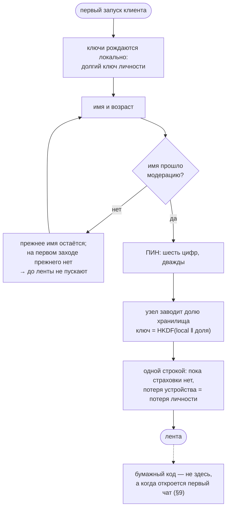
```mermaid
flowchart TD
  start(["первый запуск клиента"]) --> keys["ключи рождаются локально:<br/>долгий ключ личности"]
  keys --> form["имя и возраст"]
  form --> mod{"имя прошло<br/>модерацию?"}
  mod -- "нет" --> again["прежнее имя остаётся;<br/>на первом заходе прежнего нет<br/>→ до ленты не пускают"]
  again --> form
  mod -- "да" --> pin["ПИН: шесть цифр, дважды"]
  pin --> share["узел заводит долю хранилища<br/>ключ = HKDF#40;local ‖ доля#41;"]
  share --> warn["одной строкой: пока страховки нет,<br/>потеря устройства = потеря личности"]
  warn --> feed(["лента"])
  feed -.-> later["бумажный код — не здесь,<br/>а когда откроется первый чат #40;§9#41;"]
```

- Почты и пароля нет по построению. Единственный путь назад после потери
  устройства — бумажный код, который мы не можем ни подсказать, ни сбросить.
- Узел хранит **только публичную половину** ключа: утечка базы не даёт выдавать
  себя за людей.
- Каждый клиент начинает **отдельной** личностью. Веб на телефоне, веб на
  ноутбуке и `depth` в контейнере — три разных соседа, пока личность не перенесут
  туда сами.
- **Бумажный код перенесён с этого экрана на открытие первого чата** (18.08.2026):
  он выписывал страховку раньше, чем появлялось страхуемое. На первой минуте
  терять нечего — ни чатов, ни переписки, а имя и возраст набираются заново.
- **ПИН при этом остался здесь, и причина — терминал.** В вебе ключи лежат
  неизвлекаемыми `CryptoKey`, и ключ хранилища нужен только истории, которой ещё
  нет. Но `depth` пишет файл ключей сразу, и шифруется он тем же ключом: отложить
  ПИН значит подержать ключи на диске открытыми.

---

## 2. Чем подписывается каждый запрос ([§8.2](chat_RU.md))

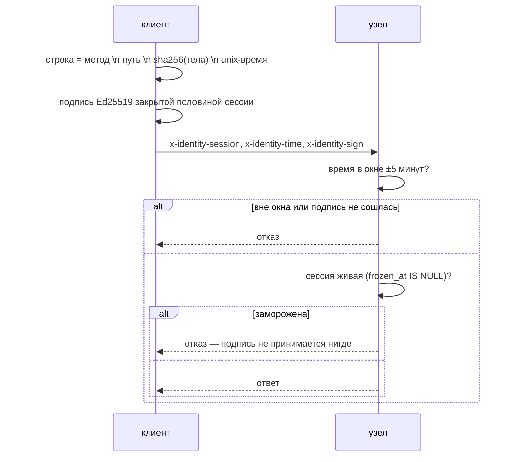
```mermaid
sequenceDiagram
  participant K as клиент
  participant N as узел
  K->>K: строка = метод \n путь \n sha256#40;тела#41; \n unix-время
  K->>K: подпись Ed25519 закрытой половиной сессии
  K->>N: x-identity-session, x-identity-time, x-identity-sign
  N->>N: время в окне ±5 минут?
  alt вне окна или подпись не сошлась
    N-->>K: отказ
  else
    N->>N: сессия живая #40;frozen_at IS NULL#41;?
    alt заморожена
      N-->>K: отказ — подпись не принимается нигде
    else
      N-->>K: ответ
    end
  end
```

- **Тело входит хэшем, а не целиком** — иначе большой запрос стоил бы вдвое.
- **Окно вместо nonce — размен.** Перехвативший запрос целиком может повторить
  его внутри пяти минут. Nonce потребовал бы общей памяти узлов; при эфемерности,
  измеряемой часами, пять минут повторяемости дешевле записи в базу на каждый
  запрос.
- Ed25519 в WebCrypto появился недавно: **до реализации надо померить** на живых
  браузерах, иначе выбор меняется на ECDSA P-256.

---

## 3. ПИН, доля узла и ключ хранилища ([§8.2](chat_RU.md))

Шесть цифр — миллион вариантов, и сами по себе они не защита. Поэтому ключ
хранилища **нельзя собрать из одного диска**.

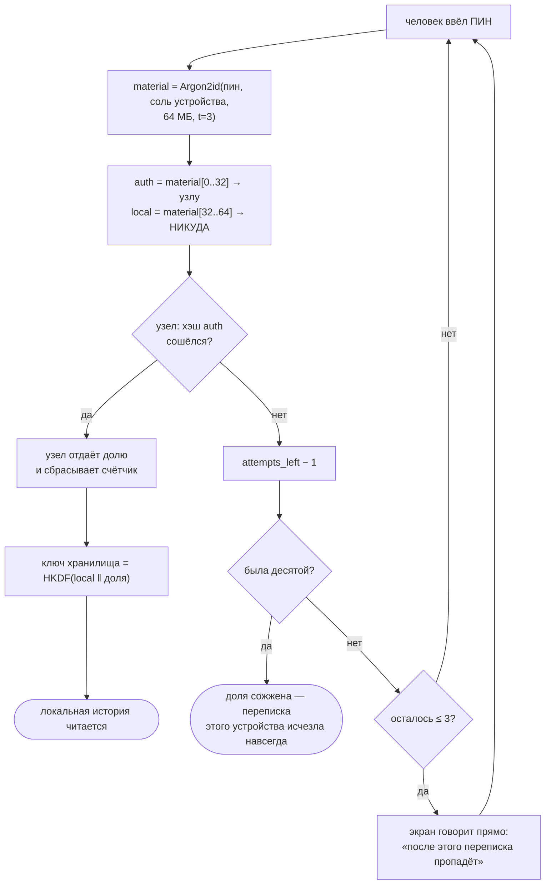
```mermaid
flowchart TD
  pin["человек ввёл ПИН"] --> argon["material = Argon2id#40;пин, соль устройства,<br/>64 МБ, t=3#41;"]
  argon --> split["auth = material[0..32] → узлу<br/>local = material[32..64] → НИКУДА"]
  split --> check{"узел: хэш auth<br/>сошёлся?"}
  check -- "да" --> give["узел отдаёт долю<br/>и сбрасывает счётчик"]
  give --> key["ключ хранилища = HKDF#40;local ‖ доля#41;"]
  key --> open(["локальная история читается"])
  check -- "нет" --> dec["attempts_left − 1"]
  dec --> burn{"была десятой?"}
  burn -- "да" --> dead(["доля сожжена — переписка<br/>этого устройства исчезла навсегда"])
  burn -- "нет" --> warn{"осталось ≤ 3?"}
  warn -- "да" --> say["экран говорит прямо:<br/>«после этого переписка пропадёт»"]
  warn -- "нет" --> pin
  say --> pin
```

- **Проверяет ПИН узел, а не устройство.** Иначе долю забирают один раз и
  перебирают миллион вариантов офлайн.
- **Доля принадлежит устройству, а не личности** — у каждого свой ПИН, своя доля,
  свой счётчик. Подступиться к чужой доле нельзя ниоткуда, в том числе с живой
  сессии той же личности.
- Две цены названы прямо: **без сети чат не открывается совсем**, и **узел стал
  держать то, без чего у людей пропадает переписка**.

---

## 4. Перенос личности на другое устройство ([§8.2](chat_RU.md))

Одна живая сессия на личность — это частичный уникальный индекс в базе, обойти
его из кода нельзя. Переход на другое устройство не добавление, а **перенос**.

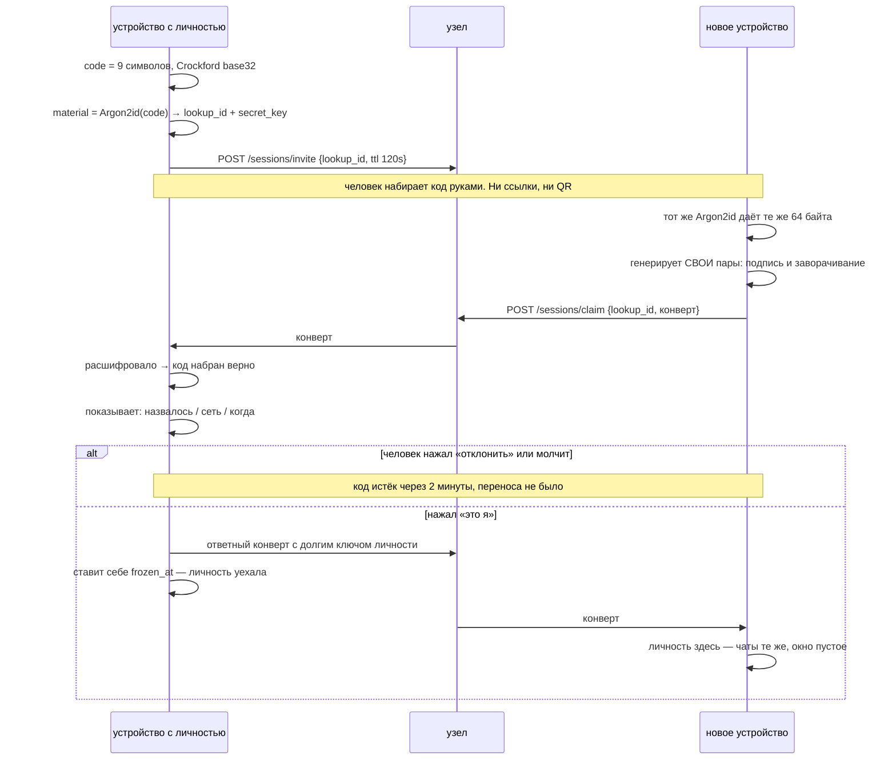
```mermaid
sequenceDiagram
  participant A as устройство с личностью
  participant N as узел
  participant B as новое устройство
  A->>A: code = 9 символов, Crockford base32
  A->>A: material = Argon2id#40;code#41; → lookup_id + secret_key
  A->>N: POST /sessions/invite #123;lookup_id, ttl 120s#125;
  Note over A,B: человек набирает код руками. Ни ссылки, ни QR
  B->>B: тот же Argon2id даёт те же 64 байта
  B->>B: генерирует СВОИ пары: подпись и заворачивание
  B->>N: POST /sessions/claim #123;lookup_id, конверт#125;
  N->>A: конверт
  A->>A: расшифровало → код набран верно
  A->>A: показывает: назвалось / сеть / когда
  alt человек нажал «отклонить» или молчит
    Note over A,B: код истёк через 2 минуты, переноса не было
  else нажал «это я»
    A->>N: ответный конверт с долгим ключом личности
    A->>A: ставит себе frozen_at — личность уехала
    N->>B: конверт
    B->>B: личность здесь — чаты те же, окно пустое
  end
```

**Что видит узел:** `lookup_id` и два непрозрачных конверта. Долгий ключ проходит
сквозь него зашифрованным.

**Почему растяжение обязательно, а не «усиление».** Девять символов — 45 бит: под
обычным хэшем перебираются за часы, и узел, знающий `lookup_id`, вывел бы
`secret_key` сам. Argon2id делает попытку дорогой на ~0.1 с; онлайновый перебор
закрывается пятью попытками на приглашение.

**Подтверждение с контекстом** показывает три строки, и каждая честна ровно
настолько, насколько может:

| строка | чем является |
|---|---|
| «назвалось» | метка со **той** стороны, ничем не подтверждена |
| «сеть» | сравнение адресов, оба видны узлу — **подсказка, а не приговор** |
| «когда» | факт |

Чего этот шаг не делает: если человека уговорили нажать, он не спасёт. Он даёт
паузу и факт.

**Что делает заморозка** — и чего не делает:

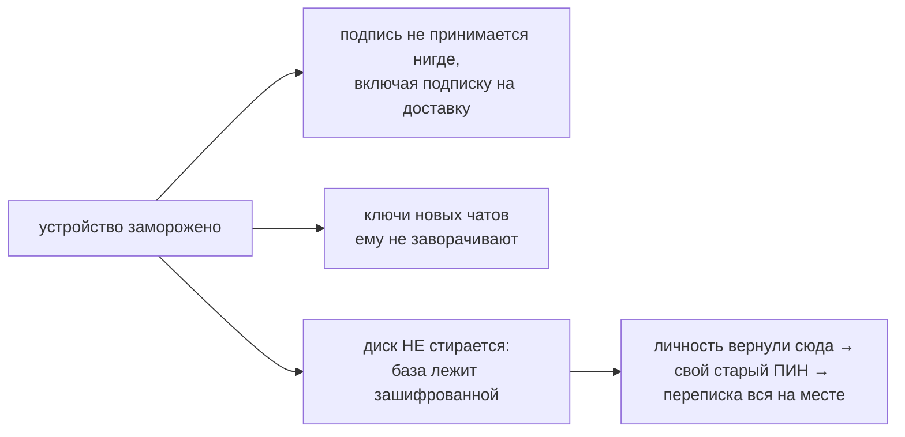
```mermaid
flowchart LR
  froze["устройство заморожено"] --> no1["подпись не принимается нигде,<br/>включая подписку на доставку"]
  froze --> no2["ключи новых чатов<br/>ему не заворачивают"]
  froze --> yes1["диск НЕ стирается:<br/>база лежит зашифрованной"]
  yes1 --> back["личность вернули сюда →<br/>свой старый ПИН → переписка вся на месте"]
```

**Отсрочку заморозки рассматривали и отклонили:** она ломает главный законный
случай — человек говорил с чужого ноутбука и ушёл. Уходя, дверь надо закрывать
сразу.

---

## 5. Восстановление по бумажному коду ([§8.2](chat_RU.md))

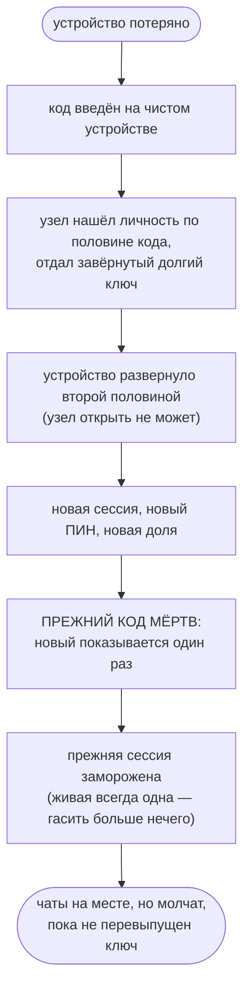
```mermaid
flowchart TD
  lost(["устройство потеряно"]) --> enter["код введён на чистом устройстве"]
  enter --> find["узел нашёл личность по половине кода,<br/>отдал завёрнутый долгий ключ"]
  find --> unwrap["устройство развернуло второй половиной<br/>#40;узел открыть не может#41;"]
  unwrap --> new["новая сессия, новый ПИН, новая доля"]
  new --> paper["ПРЕЖНИЙ КОД МЁРТВ:<br/>новый показывается один раз"]
  paper --> freeze["прежняя сессия заморожена<br/>#40;живая всегда одна — гасить больше нечего#41;"]
  freeze --> done(["чаты на месте, но молчат,<br/>пока не перевыпущен ключ"])
```

- **Бумажный код меняется только предъявлением текущего бумажного кода.** Без
  этого тот, кто увёл личность, первым делом выпишет себе новый и запрёт
  владельца навсегда — страховка исчезнет ровно тогда, когда она нужна.
- **Само восстановление выпускает новый код, а прежний убивает.** Восстанавливаются
  как раз тогда, когда что-то пошло не так, — в том числе когда бумажку могли
  увидеть.
- **16 символов = 80 бит**, Crockford base32, соль `xor.ad/recovery/v1`, Argon2id
  64 МБ. Перебор нереален даже при миллионе личностей.
- **Попытки считает ручка, а не строка личности.** Счётчик в `identities` почти не
  мог сработать: ошибка в символе рушит первую половину, узел не находит личность,
  и уменьшать нечего. Теперь счёт по адресу плюс общий счётчик промахов.

---

## 6. Публикация фразы и модерация ([§8.3](chat_RU.md))

Лента публична, её видит любой в радиусе, поэтому текст проверяется **до
публикации** — но не в тракте запроса.

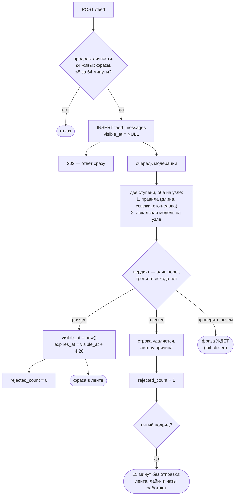
```mermaid
flowchart TD
  post["POST /feed"] --> limits{"пределы личности:<br/>≤4 живых фразы,<br/>≤8 за 64 минуты?"}
  limits -- "нет" --> refuse(["отказ"])
  limits -- "да" --> insert["INSERT feed_messages<br/>visible_at = NULL"]
  insert --> ans["202 — ответ сразу"]
  insert --> queue["очередь модерации"]
  queue --> ladder["две ступени, обе на узле:<br/>1. правила #40;длина, ссылки, стоп-слова#41;<br/>2. локальная модель на узле"]
  ladder --> verdict{"вердикт — один порог,<br/>третьего исхода нет"}
  verdict -- "passed" --> live["visible_at = now#40;#41;<br/>expires_at = visible_at + 4:20"]
  live --> zero["rejected_count = 0"]
  live --> shown(["фраза в ленте"])
  verdict -- "rejected" --> del["строка удаляется,<br/>автору причина"]
  del --> count["rejected_count + 1"]
  count --> block{"пятый подряд?"}
  block -- "да" --> mute(["15 минут без отправки;<br/>лента, лайки и чаты работают"])
  verdict -- "проверить нечем" --> wait(["фраза ЖДЁТ<br/>#40;fail-closed#41;"])
```

- **«До публикации» — правда, а не формальность.** Пока `visible_at` пуст, фразы
  нет ни в чьей выдаче, кроме выдачи автора, где она помечена как проверяемая.
  Вариант «публикуем сразу, снимаем потом» сделал бы ложью и политику витрин, и
  позицию по ст. 28.
- **4:20 отсчитывается от `visible_at`**, иначе очередь съедает чужую жизнь.
- **Отказ очереди закрывает, а не открывает.** Fail-open здесь — ровно тот приём,
  который уже отвергнут для ссылок в офферах: им и воспользуются, выбрав ночь.
- **Пять и пятнадцать выбраны мягкими.** Отказ модели не доказательство умысла:
  первым под порог попадёт не тролль, а человек, которого не поняли. Порог должен
  сбивать темп подбора формулировки, а не наказывать.
- Честно про предел: личность заводится за десять секунд, адрес меняется
  переключением на мобильную сеть. Это **замедлитель, а не стена**; настоящая
  защита — сама проверка до публикации.

---

## 7. Выдача ленты ([§8.3](chat_RU.md))

Видимость — пересечение кругов плюс возрастная полоса, **симметрично**: если я
вижу тебя, ты видишь меня.

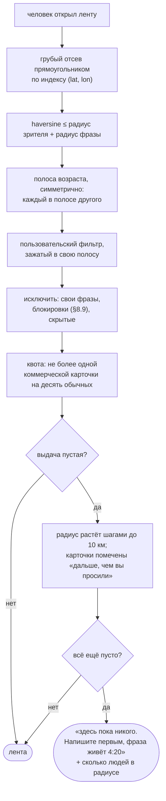
```mermaid
flowchart TD
  ask["человек открыл ленту"] --> rect["грубый отсев прямоугольником<br/>по индексу #40;lat, lon#41;"]
  rect --> hav["haversine ≤ радиус зрителя + радиус фразы"]
  hav --> band["полоса возраста, симметрично:<br/>каждый в полосе другого"]
  band --> filt["пользовательский фильтр,<br/>зажатый в свою полосу"]
  filt --> excl["исключить: свои фразы,<br/>блокировки #40;§8.9#41;, скрытые"]
  excl --> quota["квота: не более одной<br/>коммерческой карточки на десять обычных"]
  quota --> empty{"выдача пустая?"}
  empty -- "нет" --> show(["лента"])
  empty -- "да" --> grow["радиус растёт шагами до 10 км;<br/>карточки помечены «дальше, чем вы просили»"]
  grow --> empty2{"всё ещё пусто?"}
  empty2 -- "нет" --> show
  empty2 -- "да" --> nobody(["«здесь пока никого.<br/>Напишите первым, фраза живёт 4:20»<br/>+ сколько людей в радиусе"])
```

**Полосы возраста — два непересекающихся мира с мягким швом:**

```
band(A) = A ≤ 20  →  [max(13, A − 2), A + 2]      -- песочница
          A ≥ 21  →  [min(21, A − 2), ∞)          -- взрослый пул
```

20-летний видит `[18, 22]`, 21-летний — `[19, ∞)`: они встречаются. А 19 и 22 друг
друга уже не видят — правило рвётся синхронно с обеих сторон, без односторонних
дыр.

- **Полоса не расширяется никогда**, даже при пустой ленте. Разреженная песочница
  на старте — принятая цена, а не проблема, которую чинят возрастом.
- **Расширение радиуса не меняет настройку** — это временный ответ, а не тихая
  правка предпочтений.
- Следствие, которое надо знать заранее: **лайк через расширенный радиус часто не
  станет мэтчем** — второй не расширял свой круг. Кроме фразы со скидкой, где
  мэтч рождается односторонне.
- Область ставится **куда угодно**: проверки реального местоположения нет,
  разрешение на геолокацию не требуется.

---

## 8. Лайк ([§8.4](chat_RU.md), [§8.5](chat_RU.md), [§8.7](chat_RU.md))

Клиент шлёт только `feed_message_id` и получает `{state}` — кого именно он
лайкнул, ему не сообщают.

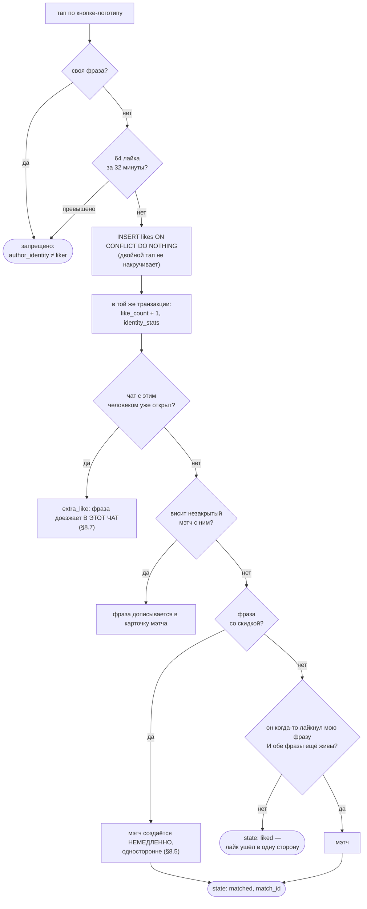
```mermaid
flowchart TD
  tap["тап по кнопке-логотипу"] --> self{"своя фраза?"}
  self -- "да" --> no(["запрещено:<br/>author_identity ≠ liker"])
  self -- "нет" --> rate{"64 лайка<br/>за 32 минуты?"}
  rate -- "превышено" --> no
  rate -- "нет" --> ins["INSERT likes ON CONFLICT DO NOTHING<br/>#40;двойной тап не накручивает#41;"]
  ins --> counters["в той же транзакции:<br/>like_count + 1, identity_stats"]
  counters --> chat{"чат с этим<br/>человеком уже открыт?"}
  chat -- "да" --> extra["extra_like: фраза доезжает В ЭТОТ ЧАТ<br/>#40;§8.7#41;"]
  chat -- "нет" --> hanging{"висит незакрытый<br/>мэтч с ним?"}
  hanging -- "да" --> card["фраза дописывается в карточку мэтча"]
  hanging -- "нет" --> discount{"фраза<br/>со скидкой?"}
  discount -- "да" --> m1["мэтч создаётся НЕМЕДЛЕННО,<br/>односторонне #40;§8.5#41;"]
  discount -- "нет" --> mutual{"он когда-то лайкнул мою фразу<br/>И обе фразы ещё живы?"}
  mutual -- "нет" --> quiet(["state: liked —<br/>лайк ушёл в одну сторону"])
  mutual -- "да" --> m2["мэтч"]
  m1 --> matched(["state: matched, match_id"])
  m2 --> matched
```

---

## 9. Мэтч и двойное согласие ([§8.5](chat_RU.md))

Мэтч — **не чат**: это предложение поговорить, которое должны принять оба.

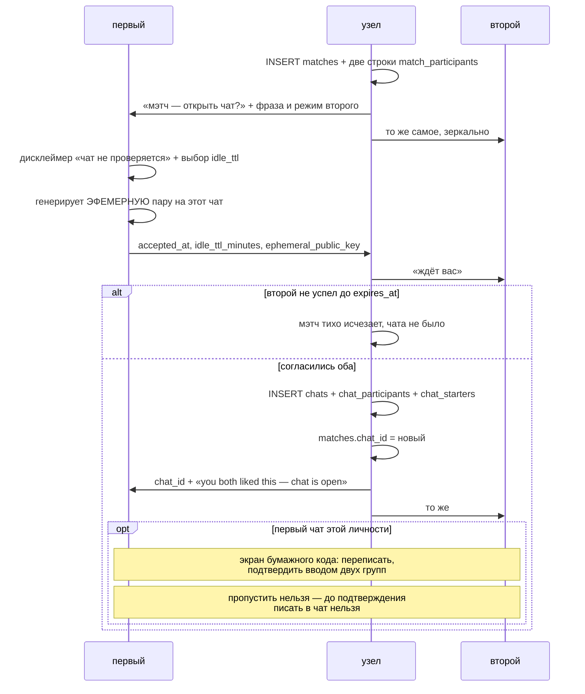
```mermaid
sequenceDiagram
  participant A as первый
  participant N as узел
  participant B as второй
  N->>N: INSERT matches + две строки match_participants
  N->>A: «мэтч — открыть чат?» + фраза и режим второго
  N->>B: то же самое, зеркально
  A->>A: дисклеймер «чат не проверяется» + выбор idle_ttl
  A->>A: генерирует ЭФЕМЕРНУЮ пару на этот чат
  A->>N: accepted_at, idle_ttl_minutes, ephemeral_public_key
  N->>B: «ждёт вас»
  alt второй не успел до expires_at
    N->>N: мэтч тихо исчезает, чата не было
  else согласились оба
    N->>N: INSERT chats + chat_participants + chat_starters
    N->>N: matches.chat_id = новый
    N->>A: chat_id + «you both liked this — chat is open»
    N->>B: то же
    opt первый чат этой личности
      Note over A,B: экран бумажного кода: переписать,<br/>подтвердить вводом двух групп
      Note over A,B: пропустить нельзя — до подтверждения<br/>писать в чат нельзя
    end
  end
```

**Бумажный код спрашивается здесь, а не при регистрации.** После открытия, а не
перед ним: гейт «перед чатом» лёг бы на экран согласия, где уже стоят дисклеймер и
выбор срока, а сверху тикает таймер мэтча — в худшем случае считанные минуты.
Первый в жизни мэтч с тремя минутами на часах и просьбой переписать шестнадцать
символов кончился бы «потом» или потерянным мэтчем. После открытия таймер не
давит: чат живёт от последней активности.

**TTL мэтча** = `least()` от `expires_at` обеих фраз, без страховочного минимума.
Умерла любая — мэтч гаснет, даже если один уже согласился. Новый взаимный лайк
срок **не продлевает**.

**Снимок текста берётся в момент мэтча**, не в момент открытия: иначе фраза
истечёт между «мэтч» и «оба нажали», и человек согласится, не видя повода.

**Окно оставлено как есть, пересмотрено 10.08.2026.** Удлинение лечит не ту
болезнь: мэтч — предложение поговорить о **конкретной** фразе, и свежесть повода
здесь и есть содержание. Цена записана прямо: **сгоревший мэтч человек не увидит
никогда**.

**Три краевых случая, все реальные:**

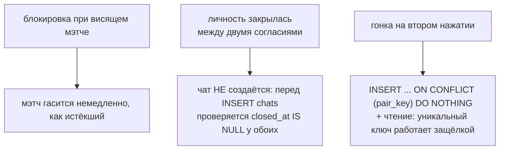
```mermaid
flowchart TD
  edge1["блокировка при висящем мэтче"] --> r1["мэтч гасится немедленно, как истёкший"]
  edge2["личность закрылась<br/>между двумя согласиями"] --> r2["чат НЕ создаётся: перед INSERT chats<br/>проверяется closed_at IS NULL у обоих"]
  edge3["гонка на втором нажатии"] --> r3["INSERT ... ON CONFLICT #40;pair_key#41; DO NOTHING<br/>+ чтение: уникальный ключ работает защёлкой"]
```

**Что раскрывается на этом шаге.** До мэтча — ничего. На карточке: фраза
собеседника, её `mode`, имя и возраст. В ленте имени и возраста нет и быть не
может — иначе все фразы одного человека склеиваются по «Женя, 38».

---

## 10. Мэтч от оффера — односторонний ([§8.5](chat_RU.md))

Обычное правило ломается о собственный смысл: чтобы забрать табуретки, пришлось бы
ждать, пока сосед, который их отдаёт, лайкнет какую-нибудь мою фразу.

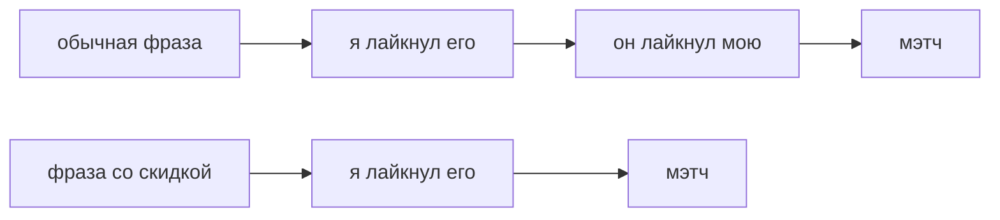
```mermaid
flowchart LR
  a["обычная фраза"] --> a1["я лайкнул его"] --> a2["он лайкнул мою"] --> a3["мэтч"]
  b["фраза со скидкой"] --> b1["я лайкнул его"] --> b3["мэтч"]
```

Дальше — та же машина без изменений: две строки `match_participants`, дисклеймер,
выбор `idle_ttl`, двойное согласие. **Автор оффера может не согласиться**, и тогда
чата не будет.

- У лайкнувшего своей фразы нет → `message_id` и `text_snapshot` стали
  необязательными.
- Повод в таком мэтче **один на двоих** — сам оффер. Автор видит своё объявление
  и «интересуется вашим предложением» плюс имя и возраст.
- `TTL` считается по единственной живой фразе — по офферу.
- У офферов **заведений** лайка нет вовсе: лайк ведёт к мэтчу, мэтч — к разговору,
  а разговаривать не с кем.

---

## 11. Открытие чата и ключи ([§8.13](chat_RU.md))

Сквозное шифрование стало возможно ровно тогда, когда чат перестали
модерировать — читать текст и не видеть его одновременно нельзя.

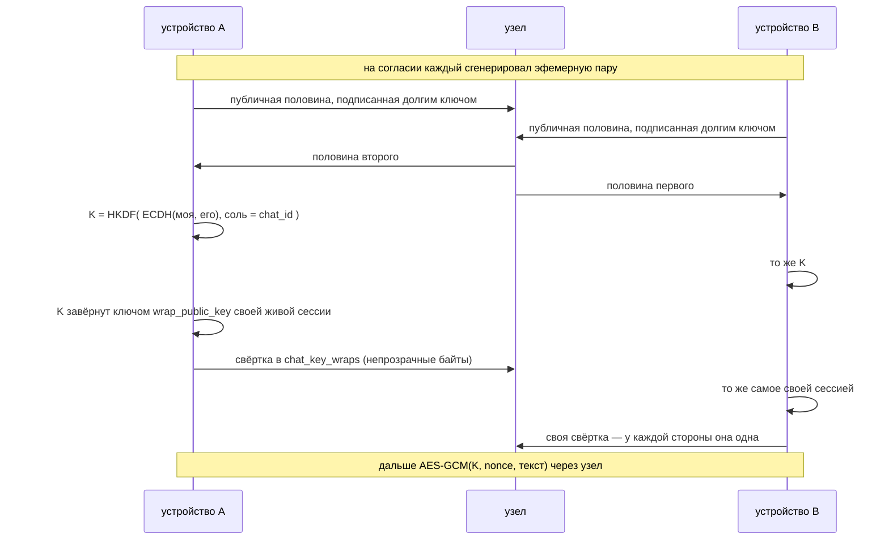
```mermaid
sequenceDiagram
  participant A as устройство A
  participant N as узел
  participant B as устройство B
  Note over A,B: на согласии каждый сгенерировал эфемерную пару
  A->>N: публичная половина, подписанная долгим ключом
  B->>N: публичная половина, подписанная долгим ключом
  N->>A: половина второго
  N->>B: половина первого
  A->>A: K = HKDF#40; ECDH#40;моя, его#41;, соль = chat_id #41;
  B->>B: то же K
  A->>A: K завёрнут ключом wrap_public_key своей живой сессии
  A->>N: свёртка в chat_key_wraps #40;непрозрачные байты#41;
  B->>B: то же самое своей сессией
  B->>N: своя свёртка — у каждой стороны она одна
  Note over A,B: дальше AES-GCM#40;K, nonce, текст#41; через узел
```

- **Ключ — на разговор, а не на человека.** Долгий ключ личности в шифровании не
  участвует вовсе. Его утечка позволяет выдать себя за человека, но **не прочитать
  переписку**.
- **Смерть чата стирает `K`, эфемерные ключи и свёртки** → расшифровать старый
  шифротекст больше нечем, никому. Это и есть прямая секретность.
- **Устройство, на которое личность только что перенесли, начинает с пустого
  экрана**: ключи чатов, открытых до его появления, заворачивать было не для кого.
  Прежние разговоры на нём не просто пусты, а **молчат** — `K` остался на старом
  устройстве. Чинится перевыпуском (ниже), одинаково после переноса и после
  восстановления.
- **Ключи живых чатов при переносе не ротируются**: ротация защищает от
  участника, который продолжает получать шифротекст, а замороженный не получает
  его вовсе.

**Чего это не даёт — прямым текстом:**

| | |
|---|---|
| Мы отдаём тот самый скрипт, который шифрует | честная формулировка — **сервер не прочитает переписку задним числом**, а не «мы физически не способны» |
| Метаданные остаются | узел знает `chat_id`, обоих участников, время движения и длину |
| От собеседника не защищает | у него открытый текст на экране — и так задумано, иначе жаловаться было бы нечем |
| Подмену ключа нами криптография не ловит | **код безопасности** из долгих ключей, показанный в шапке, двое сверяют голосом |


**Перевыпуск ключа после смены устройства** — один механизм и для переноса, и для
восстановления:

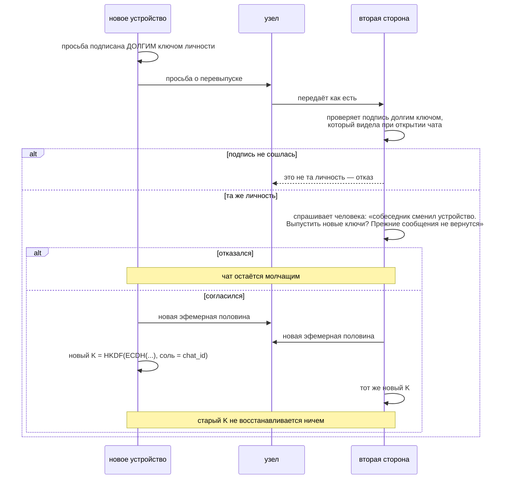
```mermaid
sequenceDiagram
  participant A as новое устройство
  participant N as узел
  participant B as вторая сторона
  A->>A: просьба подписана ДОЛГИМ ключом личности
  A->>N: просьба о перевыпуске
  N->>B: передаёт как есть
  B->>B: проверяет подпись долгим ключом,<br/>который видела при открытии чата
  alt подпись не сошлась
    B-->>N: это не та личность — отказ
  else та же личность
    B->>B: спрашивает человека: «собеседник сменил устройство.<br/>Выпустить новые ключи? Прежние сообщения не вернутся»
    alt отказался
      Note over A,B: чат остаётся молчащим
    else согласился
      A->>N: новая эфемерная половина
      B->>N: новая эфемерная половина
      A->>A: новый K = HKDF#40;ECDH#40;...#41;, соль = chat_id#41;
      B->>B: тот же новый K
      Note over A,B: старый K не восстанавливается ничем
    end
  end
```

- **Подпись долгим ключом, а не членство в чате**: строки в `chat_participants`
  достаточно и тому, кто увёл личность. Долгий ключ — единственное, что переживает
  смену устройства и не лежит на узле открытым.
- **Спрашивают человека**, по той же причине, по которой перенос требует «это я».
- **Код безопасности не меняется** — он из долгих ключей, а они те же.
- **Прямая секретность укрепляется**: новый `K` прежнему устройству недоступен.
- Не чинит кражу личности целиком: с долгим ключом на руках перевыпуск сработает и
  у злоумышленника.

---

## 12. Сообщение ([§8.8](chat_RU.md), [§8.1](chat_RU.md))

**Таблицы `messages` не существует.** Сообщение проходит через узел
зашифрованным; история живёт только на устройствах участников.

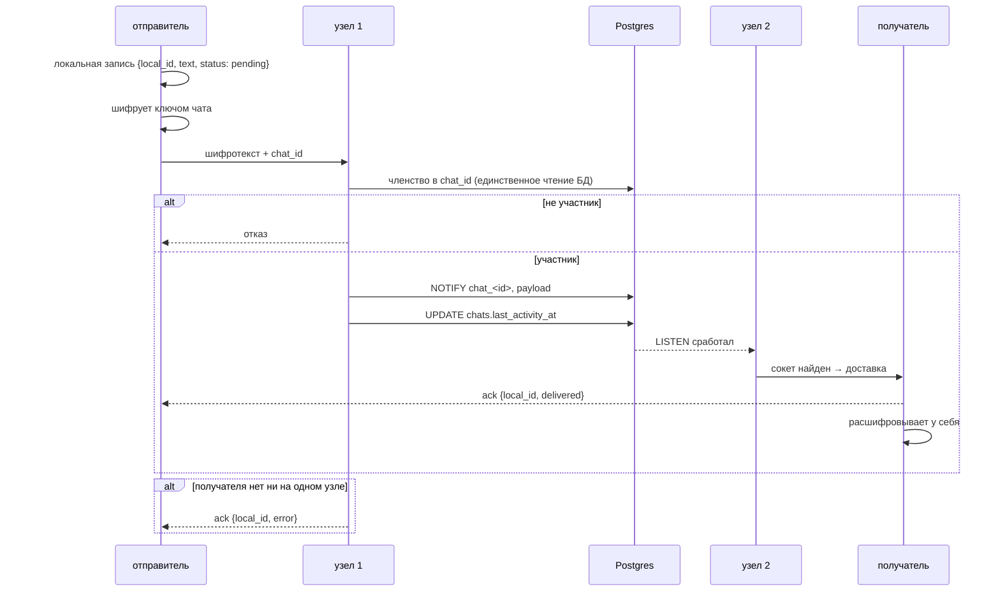
```mermaid
sequenceDiagram
  participant A as отправитель
  participant N1 as узел 1
  participant PG as Postgres
  participant N2 as узел 2
  participant B as получатель
  A->>A: локальная запись #123;local_id, text, status: pending#125;
  A->>A: шифрует ключом чата
  A->>N1: шифротекст + chat_id
  N1->>PG: членство в chat_id #40;единственное чтение БД#41;
  alt не участник
    N1-->>A: отказ
  else участник
    N1->>PG: NOTIFY chat_#60;id#62;, payload
    N1->>PG: UPDATE chats.last_activity_at
    PG-->>N2: LISTEN сработал
    N2->>B: сокет найден → доставка
    B-->>A: ack #123;local_id, delivered#125;
    B->>B: расшифровывает у себя
  end
  alt получателя нет ни на одном узле
    N1-->>A: ack #123;local_id, error#125;
  end
```

**Статусы — состояние на клиенте отправителя, не строка в БД:**

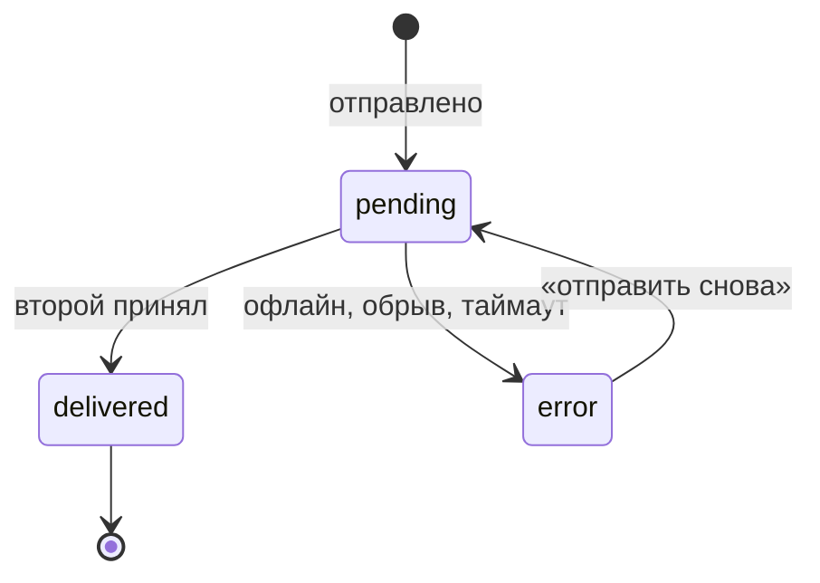
```mermaid
stateDiagram-v2
  [*] --> pending: отправлено
  pending --> delivered: второй принял
  pending --> error: офлайн, обрыв, таймаут
  error --> pending: «отправить снова»
  delivered --> [*]
```

- **Переотправка всегда доступна при `error`**, без оглядки на то, в сети ли
  собеседник. Пауза растёт ×3: сразу, 5 с, 15 с, 45 с, 135 с, потолок ~10 мин.
  Повтор идёт с тем же `local_id`, чтобы получатель отбросил дубль.
- **Длина — параметр сервера.** `max_message_length` приходит при открытии чата,
  по умолчанию 256; клиент рисует счётчик, но **решает узел** и длинное отвергает
  с `error`. Клиент у нас открытый: проверка, живущая только в нём, — подсказка
  автору, а не правило системы.
- **Узел не должен иметь значения.** Комната не живёт в памяти одного узла:
  участники могут сидеть на разных, падение узла роняет только его сокеты.
  Ограничение — шина работает в пределах одной базы.
- **Чат не модерируется.** Вместо этого работают четыре вещи: вход по взаимному
  лайку с двойным согласием, блокировка, жалоба с копией и эфемерность.

---

## 13. Жизнь и смерть чата ([§5](chat_RU.md), [§8.6](chat_RU.md))

TTL скользящий, от последней активности. Активность — **любое совместное
действие**, а не только текст: ход в игре двигает таймер намеренно.

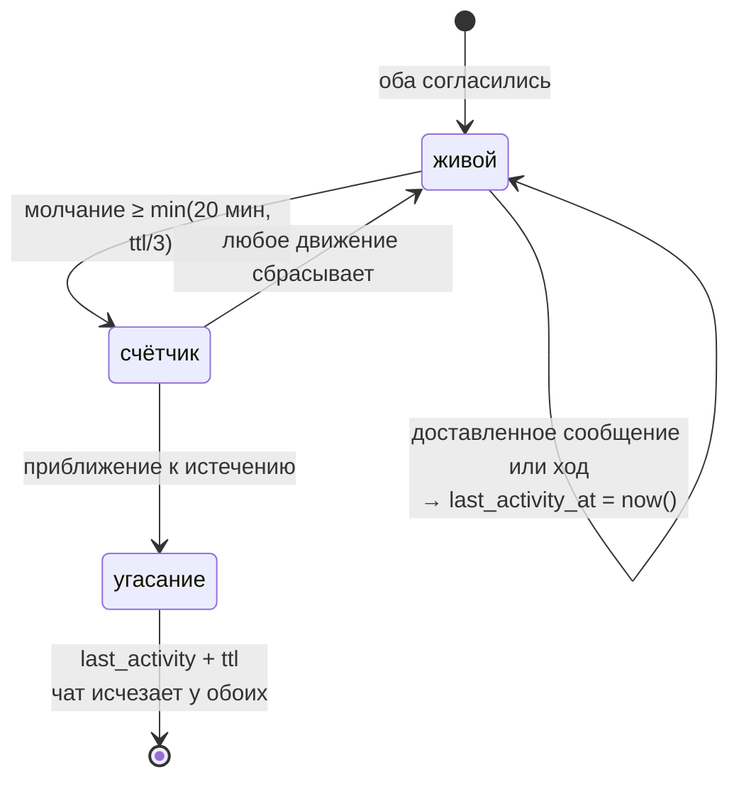
```mermaid
stateDiagram-v2
  [*] --> живой: оба согласились
  живой --> живой: доставленное сообщение или ход<br/>→ last_activity_at = now#40;#41;
  живой --> счётчик: молчание ≥ min#40;20 мин, ttl/3#41;
  счётчик --> живой: любое движение сбрасывает
  счётчик --> угасание: приближение к истечению
  угасание --> [*]: last_activity + ttl<br/>чат исчезает у обоих
```

- `idle_ttl_minutes` каждый выбирает на согласии из **20 минут / 1 час / 4:20**;
  берётся **меньшее из двух** — осторожность одного не перебивается щедростью
  другого. Значение видно обоим, **кто его поставил — нет**. В открытом чате не
  меняется.
- Порог показа счётчика взят не буквально: при `ttl = 30 мин` фиксированные
  двадцать зажгли бы его почти сразу и он висел бы две трети жизни чата.
- Сервер ничего не шлёт: клиент знает `last_activity_at` и `idle_ttl_minutes` и
  считает сам.
- Единственное, что сервер узнаёт о переписке, — **когда** было движение. Без
  текста, автора и количества.
- **Один чат на пару**, пока он жив: уникальный `pair_key`. После смерти чата
  `pair_key` освобождается, и пара может состыковаться заново — но на общих
  правилах.

---

## 14. Дополнительный лайк в открытый чат ([§8.7](chat_RU.md))

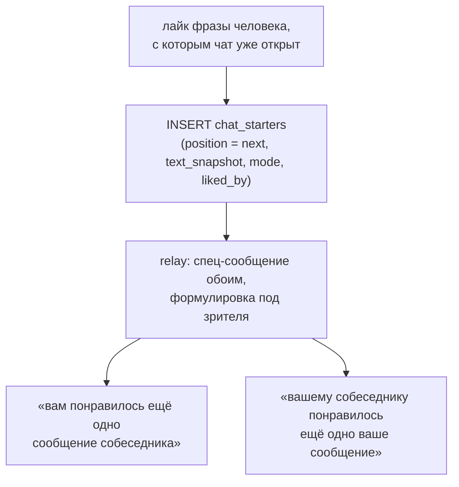
```mermaid
flowchart TD
  like["лайк фразы человека,<br/>с которым чат уже открыт"] --> row["INSERT chat_starters<br/>#40;position = next, text_snapshot, mode, liked_by#41;"]
  row --> msg["relay: спец-сообщение обоим,<br/>формулировка под зрителя"]
  msg --> me["«вам понравилось ещё одно<br/>сообщение собеседника»"]
  msg --> you["«вашему собеседнику понравилось<br/>ещё одно ваше сообщение»"]
```

Пузырь исчезнет вместе с локальной историей, строка в `chat_starters` — нет.
Номер карточки совпадает с номером в шапке `Liked, in order`: это та же сущность,
доехавшая позже.

---

## 15. Игра ([§6](chat_RU.md))

Домино, шашки, шахматы — **без единого зашитого правила**: движок только рисует
доску и даёт свободно двигать фигуры.

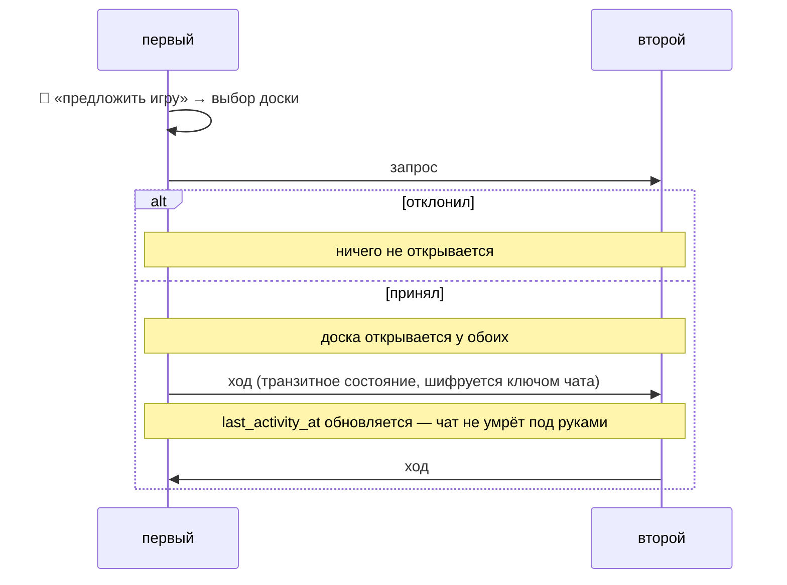
```mermaid
sequenceDiagram
  participant A as первый
  participant B as второй
  A->>A: 🎲 «предложить игру» → выбор доски
  A->>B: запрос
  alt отклонил
    Note over A,B: ничего не открывается
  else принял
    Note over A,B: доска открывается у обоих
    A->>B: ход #40;транзитное состояние, шифруется ключом чата#41;
    Note over A,B: last_activity_at обновляется — чат не умрёт под руками
    B->>A: ход
  end
```

Нет валидации ходов, счёта и победителя. Двигать фигуры могут оба. Доска живёт в
рамках чата и исчезает вместе с ним; в БД не пишется.

---

## 16. Три разных действия против человека ([§8.9](chat_RU.md), [§8.10](chat_RU.md))

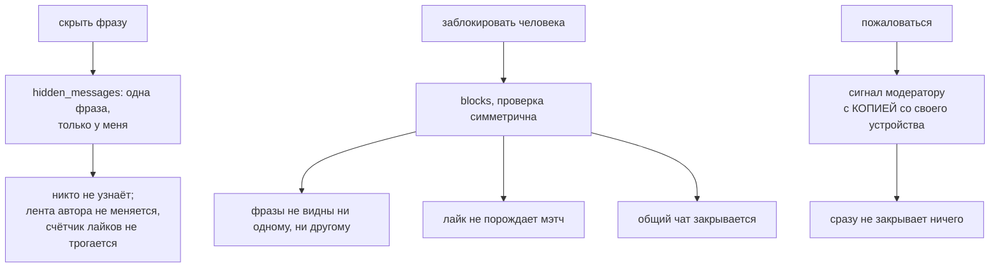
```mermaid
flowchart TD
  hide["скрыть фразу"] --> h1["hidden_messages: одна фраза,<br/>только у меня"]
  h1 --> h2["никто не узнаёт;<br/>лента автора не меняется,<br/>счётчик лайков не трогается"]
  block["заблокировать человека"] --> b1["blocks, проверка симметрична"]
  b1 --> b2["фразы не видны ни одному, ни другому"]
  b1 --> b3["лайк не порождает мэтч"]
  b1 --> b4["общий чат закрывается"]
  report["пожаловаться"] --> r1["сигнал модератору<br/>с КОПИЕЙ со своего устройства"]
  r1 --> r2["сразу не закрывает ничего"]
```

**Предел блокировки назван честно.** Она держится, пока человек не завёл новую
личность, — а это десять секунд. В ленте он вернётся. Но чтобы снова добраться до
**вас лично**, нужен новый взаимный лайк на живых фразах и ваше согласие открыть
чат: **дверь в разговор сторожит не блокировка, а сама модель входа**.

**Жалоба несёт свою копию**, потому что текста на сервере нет. Значит жалоба — это
слово одной стороны, и обращаться с ней надо как с сигналом, а не как с
доказательством.

---

## 17. Смена имени и возраста ([§8.2](chat_RU.md))

Имя и возраст можно менять **без потери личности и чатов** — сознательный размен:
человеку не надо стирать себя ради опечатки или наступившего дня рождения.

```mermaid
flowchart TD
  edit["правка имени или возраста"] --> what{"что меняют?"}
  what -- "имя" --> mod{"модерация имени"}
  mod -- "отказ" --> keep["отвергнутое имя НЕ сохраняется,<br/>прежнее остаётся действовать"]
  mod -- "прошло" --> sys1["во все открытые чаты:<br/>«собеседник теперь называет себя иначе»"]
  what -- "возраст" --> cross{"переход через границу 20/21?"}
  cross -- "нет" --> ok["свободно внутри своей полосы"]
  cross -- "20 → 21" --> up["разрешено, НЕОБРАТИМО<br/>#40;предупредить до сохранения#41;"]
  cross -- "21 → 20" --> deny["запрещено: взрослый не уходит<br/>в подростковую песочницу"]
  ok --> clamp["filter_age_min/max<br/>пере-зажимаются в новую полосу"]
  up --> clamp
  clamp --> sys2["во все открытые чаты:<br/>«собеседник изменил возраст: 39»"]
```

- **Раз в год** приложение переспрашивает «вам всё ещё 38?». **Молчание ничего не
  меняет**: переспрос не проверка — соврать в нём можно ровно так же, как при
  регистрации, — поэтому наказывать за неответ значит мешать честному и ничего не
  отнимать у нечестного.
- **Молча подменять имя в открытом разговоре нельзя**: собеседник согласился
  говорить с конкретным человеком, и подмена без следа — способ обмана, а не
  удобство.
- **Смена личности** — отдельное действие «начать заново»: старая помечается
  `closed_at`, всё теряется вместе с её долгим ключом.

---

## 18. Инбокс: что было, пока меня не было ([§8.12](chat_RU.md))

Отдельной таблицы `notifications` **нет** — всё выводится из `matches`, `chats`,
`chat_starters` и `last_activity_at`.

```mermaid
flowchart TD
  open(["клиент открыли"]) --> cold["GET /inbox — только для холодного входа"]
  cold --> q1["мэтчи, ждущие моего решения"]
  cold --> q2["«ждёт вас»: я согласился, второй нет"]
  cold --> q3["чат открылся: строка в chats,<br/>которой нет в моей локальной базе"]
  cold --> q4["понравилась ещё одна фраза:<br/>chat_starters с position больше виденного"]
  cold --> q5["чат угасает: last_activity + ttl близко"]
  q1 --> tabs["счётчики на табах Chats N / Matches N"]
  q2 --> tabs
  q3 --> tabs
  q4 --> tabs
  q5 --> tabs
  open --> ws["пока вкладка открыта — то же самое<br/>прилетает по WebSocket"]
```

**Пропущенное сообщение восстанавливается косвенно:**

```
server.last_activity_at > времени моего последнего локального сообщения
   → «здесь что-то было, а у вас этого нет»
   → строка «вы пропустили сообщение — попросите прислать снова»
```

Сам текст не восстановится никогда.

**Пушей нет — ни в одном лице.** Ни Web Push, ни системных уведомлений в
терминале, ни `BEL`.

```mermaid
flowchart LR
  push["пуш"] --> mid["невозможен без посредника:<br/>service worker + чужая служба доставки,<br/>или системная шина"]
  mid --> meta["посреднику достаётся:<br/>устойчивый идентификатор подписки<br/>и РИТМ — когда, как часто, в какие часы"]
  meta --> no(["отдавать метаданные ради удобства —<br/>противоречие всей §8"])
```

**Чем платим — прямым текстом.** Позвать человека, которого сейчас нет в
приложении, **нечем**. Сгоревшего мэтча он не увидит никогда: инбокс показывает
лишь то, что дожило. Прямое следствие: **эта система работает для того, кто
заходит сам и регулярно**, и не работает для того, кто ждёт, что его позовут.

| Слой | Когда работает |
|---|---|
| Живое соединение | клиент открыт — события приходят мгновенно |
| Инбокс | клиент открыли снова — видно всё, что дожило |
| — | клиент закрыт — не приходит ничего |

---

## 19. Три таймера и уборка ([§8.10](chat_RU.md))

Три разных срока, три разных повода — их нельзя сводить в один.

```mermaid
flowchart TD
  feed["фраза в ленте"] --> f1["expires_at = visible_at + 4:20"]
  f1 --> f2["выпадает из выдачи, фон удаляет строку,<br/>likes уходят каскадом"]
  f2 --> f3["chat_starters НЕ ломаются:<br/>текст скопирован, а не связан ссылкой"]
  match["мэтч"] --> m1["least#40;#41; от обеих фраз"]
  m1 --> m2["истёк — исчез, чата не было"]
  chat["чат"] --> c1["last_activity_at + idle_ttl_minutes"]
  c1 --> c2["узел вычёркивает chats;<br/>chat_participants, chat_starters,<br/>chat_key_wraps — каскадом"]
```

**Локальную историю чистит клиент, инициатива всегда у него:**

```
POST /chats/alive  { ids: [uuid, ...] }  →  { alive: [uuid, ...] }
```

Всё, чего нет в `alive`, удаляется из IndexedDB вместе с сообщениями. Одна сверка
закрывает разом истёкший TTL, закрытую личность собеседника, блокировку и «месяц
не заходил».

Фразу **можно снять самому** — снятая исчезает так же, как истёкшая. Слот
освобождается сразу, потолок «8 за 64 минуты» — нет: он и заведён ровно против
того, кто снимает фразу по кругу, чтобы освободить слот.

---

## 20. Доставка между узлами ([§8.1](chat_RU.md))

```mermaid
flowchart LR
  A["участник A"] -- ws --> N1["узел 1"]
  N1 -- "NOTIFY chat_id, payload" --> PG[("Postgres")]
  PG -- "LISTEN на всех узлах" --> N2["узел 2"]
  N2 -- ws --> B["участник B"]
  PG -- "LISTEN" --> N3["узел 3"]
  N3 -.-> none["сокета нет — ничего не делает"]
```

`LISTEN`/`NOTIFY` подходит необычно хорошо: это **транзитная** доставка без
записи — ровно то, что нужно чату без истории. 8 КБ payload перекрывают сообщение
в 256 символов с запасом. Новых зависимостей ноль: Postgres уже есть, Redis не
нужен.

Ограничение, которое надо помнить: шина работает **в пределах одной базы**.
Географически разнесённые независимые базы потребуют другого решения.

---

## 21. Лестница раскрытия ([§8.11](chat_RU.md))

Раскрытие ступенчатое и необратимое — поэтому «открыть чат» осознанное нажатие,
а не автоматика.

```mermaid
flowchart TD
  L1["Лента"] --> L1d["id фразы, текст, mode,<br/>КРУГ #40;центр + радиус#41;, like_count, время<br/>— и ничего об авторе"]
  L1d --> L2["Мэтч"]
  L2 --> L2d["+ фраза собеседника и mode,<br/>ИМЯ, ВОЗРАСТ, таймер"]
  L2d --> L3["Чат"]
  L3 --> L3d["+ chat_starters, idle_ttl_minutes,<br/>last_activity_at"]
  L3d --> never["НИКОГДА: чужой identity_id,<br/>приватные ключи, авторство фраз в ленте,<br/>кто лайкнул, число чатов, текст переписки"]
```

**Граница проходит по чату, а не по фразе.** В ленте автор не светится никогда.
Но как только чат открылся, авторство внутри него известно по построению — и это
не утечка, а суть открытого чата: люди решили познакомиться. Важно другое: **этот
набор не выходит за пределы чата** и умирает вместе с ним.

Что видит перехватчик трафика: uuid'ы, тексты фраз ленты (они и так публичны) и
**шифротекст** переписки. Чего не видит: содержание разговора, кто автор фразы,
кто лайкнул, связаны ли две фразы одним человеком.
